# Architecture Documentation

Status: Task 03 complete, awaiting approval

This document defines the production architecture for the Secure Dance Academy
Management System. It follows the approved requirements baseline and does not add
new business scope. It is written to support Task 04 and later implementation work
without forcing a redesign.

Each major architectural concept below is paired with a Mermaid diagram so the
design is visual as well as descriptive.

## Architecture Baseline

- Single-academy system for the current release.
- Controlled onboarding only; no public self-registration.
- Role-based access control for administrator, coach, parent, and artist workflows.
- Child and medical information are protected by role plus ownership checks.
- Attendance, performance, injury, medical, activity, report, dashboard, settings,
  audit, search, filtering, pagination, and export flows are in scope.
- Payments, public marketing pages, mobile apps, multi-academy tenancy, and AI
  assistance remain out of scope for this baseline.

## Foundation Alignment

The current repository already matches the intended direction:

- `app/` provides the Next.js App Router shell.
- `middleware.ts` applies security headers and coarse protected-route gating.
- `lib/env.ts` validates runtime configuration.
- `lib/api/responses.ts` standardizes API output.
- `lib/validation/request.ts` centralizes request validation.
- `lib/security/*` reserves security helpers for rate limiting, headers, logging,
  and audit support.
- `prisma/schema.prisma` is scaffolded and ready for Task 04 database modelling.
- `features/` reserves feature boundaries without mixing responsibilities.

## Architecture Goals

- Keep business logic isolated from UI and data access.
- Keep each feature independent and testable.
- Enforce security on the server, not in the browser.
- Make the correct implementation the easiest implementation.
- Support future expansion without introducing unnecessary complexity.

## Confirmed Technology Decisions

| Area | Decision | Why |
| --- | --- | --- |
| Frontend | Next.js 15, TypeScript, Tailwind CSS, shadcn/ui | Matches the approved stack and supports server-first rendering. |
| Backend | Next.js Route Handlers and Server Actions | Keeps the application in one deployable surface with clear request boundaries. |
| Validation | Zod | Gives the same schema language to client and server. |
| Data Access | Prisma ORM | Keeps database access structured and reviewable. |
| Database | Supabase PostgreSQL | Approved persistent store for normalized relational data. |
| Authentication | Supabase Authentication | Approved identity provider with managed password flows. |
| Deployment | Vercel and Docker Compose | Production deployment plus local parity. |
| UI Feedback | Sonner, loading/error/empty states | Supports clear, consistent user interaction. |
| Testing | Jest, Playwright, OWASP ZAP, SonarQube | Covers unit, integration, end-to-end, security, and maintainability checks. |

## Module Boundaries

| Module | Responsibility | Boundary Notes |
| --- | --- | --- |
| Authentication | Login, logout, password recovery, session handling | Owns session lifecycle but not general profile data. |
| Users | Account profiles and user-facing preferences | Keeps identity metadata separate from auth mechanics. |
| Roles | RBAC definitions and assignments | Used by server-side authorization only. |
| Artists | Performer profiles and assignments | Supports both child and adult artists. |
| Parents | Guardian profiles and dependent relationships | Enforces parent-to-child ownership rules. |
| Coaches | Coach profiles and artist assignments | Limits access to assigned artists. |
| Attendance | Attendance capture, update, and review | Sensitive operational record. |
| Performance | Performance and rehearsal tracking | Supports schedules, outcomes, and tracking. |
| Injuries | Injury reports and follow-up | Restricted to authorized roles. |
| Medical Records | Protected health-related records | Highest sensitivity outside authentication. |
| Activities | Classes, events, and administrative activity | Supports scheduling and coordination. |
| Reports | Operational and administrative reporting | Read-only access built from service queries. |
| Dashboard | Role-specific summaries and charts | Composes data without owning business rules. |
| Notifications | In-app notifications and delivery abstraction | Delivery provider remains swappable. |
| Audit Logs | Immutable accountability trail | Append-only by design. |
| Settings | Preferences and administrative configuration | Configuration is server-validated. |

### Module Boundary Diagram

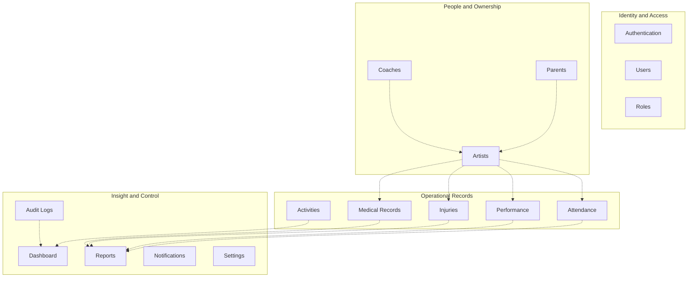

The arrows show permitted data flow between feature groups. They do not imply
shared business logic.

## Layer Responsibilities

| Layer | Responsibilities | Must Not Do |
| --- | --- | --- |
| Presentation | Pages, layouts, forms, tables, dialogs, navigation | Contain business rules or data access. |
| Application | Use cases, workflows, authorization checks, request orchestration | Talk directly to the browser or database. |
| Business Logic | Core rules, entity meaning, invariants, ownership logic | Depend on framework details. |
| Data Access | Repository methods and persistence mapping | Decide business policy. |
| Infrastructure | Supabase, Prisma, logging, rate limiting, headers, env, external services | Leak implementation details into UI. |
| Utilities | Pure helpers, formatting, small reusable functions | Grow into hidden business logic. |

### Layer Dependency Diagram

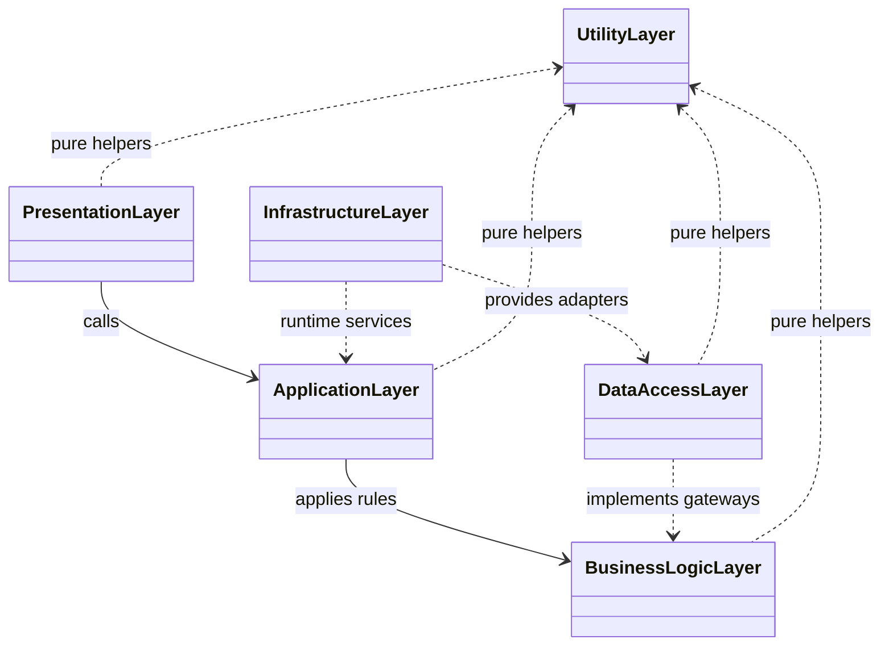

This diagram shows the inward dependency rule and keeps presentation, business
logic, data access, and infrastructure responsibilities distinct.

## Folder Structure

| Folder | Purpose |
| --- | --- |
| `app/` | Routes, layouts, route handlers, and server entry points. |
| `features/` | Feature-owned implementation for pages, components, services, repositories, validation, tests, and README files. Each feature can contain `components`, `services`, `repositories`, `schemas`, `types`, and `tests` subfolders as needed. |
| `components/` | Shared UI primitives and layout components. |
| `services/` | Cross-feature orchestration services only. Feature-specific services stay inside each feature. |
| `repositories/` | Cross-feature data access helpers only. Feature-specific repositories stay inside each feature. |
| `lib/` | Cross-cutting utilities, security helpers, Supabase clients, validation helpers, and API response helpers. |
| `hooks/` | Shared React hooks that do not own business logic. |
| `types/` | Shared TypeScript types and contracts. |
| `utils/` | Pure utility functions. |
| `config/` | Site and security configuration. |
| `middleware/` | Documentation for runtime middleware; the executable edge middleware remains `middleware.ts` at the root. |
| `prisma/` | Schema, migrations, seed data, and database tooling. |
| `tests/` | Test setup, helpers, and cross-feature test assets. |
| `docs/` | Requirements, architecture, decisions, security, testing, and deployment documentation. |
| `public/` | Static assets that do not require server processing. |

### Folder Structure Diagram

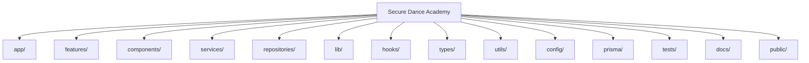

The top-level tree keeps ownership obvious and avoids dumping unrelated code into
shared folders.

## Request Lifecycle

1. The browser sends a request to the Next.js app.
2. `middleware.ts` applies security headers and coarse protected-route gating.
3. Protected routes resolve the authenticated session on the server.
4. Request input is validated with Zod before business logic executes.
5. Authorization checks evaluate identity, role, ownership, and context.
6. A feature service executes the use case.
7. A repository performs the Prisma query or transaction.
8. Sensitive mutations emit an immutable audit event.
9. The standardized response helper returns success or a sanitized error.
10. The client renders the result or the appropriate loading, empty, or error state.

## Security Boundaries

- The browser is untrusted.
- Client validation improves usability but never authorizes access.
- Middleware is a coarse gate, not a replacement for server authorization.
- Route handlers and server actions are the authoritative security boundary.
- Repositories are the only code allowed to talk to Prisma.
- Audit logs are append-only and separated from application logs.
- Secrets, service role keys, and database URLs stay server-side.
- Child and medical records require both role and ownership checks.
- No token storage is allowed in localStorage.

## Data Model

| Concept | Role in the Architecture |
| --- | --- |
| User | Authenticated account linked to one or more application roles. |
| Role | RBAC label used by authorization logic. |
| Artist Profile | Performer record for child or adult artists. |
| Parent Profile | Guardian profile that owns dependent artist access. |
| Coach Profile | Coach record that grants access to assigned artists. |
| Attendance Record | Time-based operational record tied to an artist. |
| Performance Record | Rehearsal or performance tracking record. |
| Injury Record | Protected operational and safety record. |
| Medical Record | Highly restricted health-related record. |
| Activity | Class, event, or administrative activity. |
| Notification | In-app message and delivery intent. |
| Audit Event | Immutable record of sensitive actions. |
| Setting | User or system configuration item. |

### Entity Relationship Diagram

```mermaid
erDiagram
  USERS ||--o{ USER_ROLES : assigned
  ROLES ||--o{ USER_ROLES : grants
  USERS ||--o| ARTIST_PROFILES : owns
  USERS ||--o| PARENT_PROFILES : owns
  USERS ||--o| COACH_PROFILES : owns
  PARENTS ||--o{ PARENT_ARTIST_LINKS : manages
  ARTISTS ||--o{ PARENT_ARTIST_LINKS : dependent
  COACHES ||--o{ COACH_ARTIST_ASSIGNMENTS : assigned
  ARTISTS ||--o{ COACH_ARTIST_ASSIGNMENTS : tracked
  ACTIVITIES ||--o{ ATTENDANCE_RECORDS : includes
  ARTISTS ||--o{ ATTENDANCE_RECORDS : attends
  ARTISTS ||--o{ PERFORMANCE_RECORDS : performs
  ARTISTS ||--o{ INJURY_RECORDS : injury
  ARTISTS ||--o{ MEDICAL_RECORDS : medical
  USERS ||--o{ NOTIFICATIONS : receives
  USERS ||--o{ AUDIT_EVENTS : performs

  USERS {
    uuid id PK
    string email
    string status
  }
  ROLES {
    uuid id PK
    string name
  }
  USER_ROLES {
    uuid user_id FK
    uuid role_id FK
  }
  ARTIST_PROFILES {
    uuid id PK
    uuid user_id FK
    string performer_type
  }
  PARENT_PROFILES {
    uuid id PK
    uuid user_id FK
  }
  COACH_PROFILES {
    uuid id PK
    uuid user_id FK
  }
  PARENT_ARTIST_LINKS {
    uuid parent_id FK
    uuid artist_id FK
  }
  COACH_ARTIST_ASSIGNMENTS {
    uuid coach_id FK
    uuid artist_id FK
  }
  ACTIVITIES {
    uuid id PK
    string title
  }
  ATTENDANCE_RECORDS {
    uuid id PK
    uuid artist_id FK
    uuid activity_id FK
  }
  PERFORMANCE_RECORDS {
    uuid id PK
    uuid artist_id FK
  }
  INJURY_RECORDS {
    uuid id PK
    uuid artist_id FK
  }
  MEDICAL_RECORDS {
    uuid id PK
    uuid artist_id FK
  }
  NOTIFICATIONS {
    uuid id PK
    uuid user_id FK
  }
  AUDIT_EVENTS {
    uuid id PK
    uuid actor_user_id FK
  }
```

This model keeps identity, ownership, operational records, and auditability
separate while preserving clear relationships for reporting and access control.

## Authentication Architecture

- Supabase Authentication handles credentials, password reset, email verification,
  and session refresh.
- Sessions are stored in secure HTTP-only cookies.
- Controlled onboarding is used instead of public sign-up.
- Password policy enforcement remains server-side and aligned with the approved
  security requirements.
- Logout invalidates the session server-side and removes the secure cookie.

### Authentication Session State Diagram

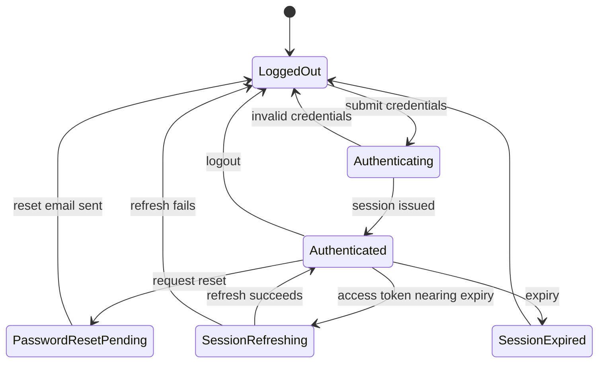

The authentication model has a small number of stable states so session handling
remains predictable and secure.

## Authorization Architecture

- Authorization is RBAC plus ownership plus context.
- The supported roles are administrator, coach, parent, and artist.
- Administrators receive controlled elevated access.
- Coaches can only access assigned artists and related operational data.
- Parents can only access their own dependent artist profiles.
- Artists can only access their own records.
- Every protected endpoint checks identity, role, permission, and ownership.

### Authorization Decision Flow

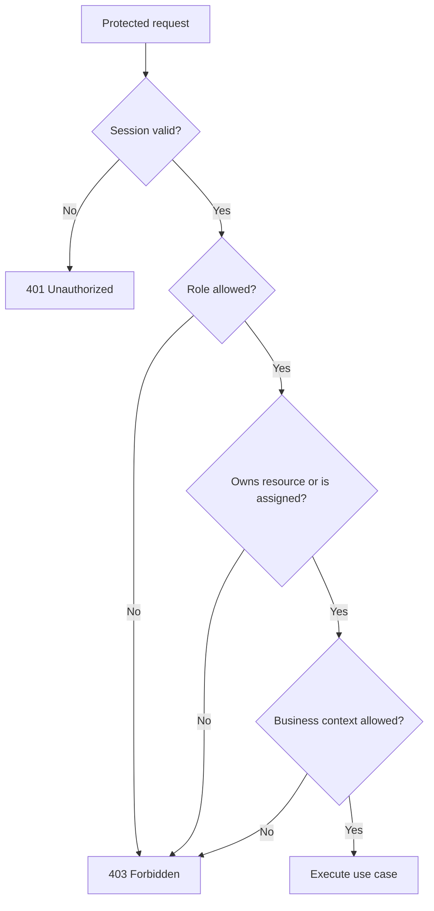

This keeps authorization server-side and makes the rejection path explicit before
any business logic runs.

## State Management And Component Design

- Server Components are the default.
- Client Components are used only where interaction requires them.
- Server Actions handle mutations whenever they fit the use case.
- Local component state is preferred over global state.
- Shared UI belongs in `components/ui` and `components/layout`.
- Feature-specific UI belongs under the relevant feature module.
- Forms, tables, charts, dialogs, badges, search, filters, and pagination controls
  are built as reusable primitives.

### Component Ownership Diagram

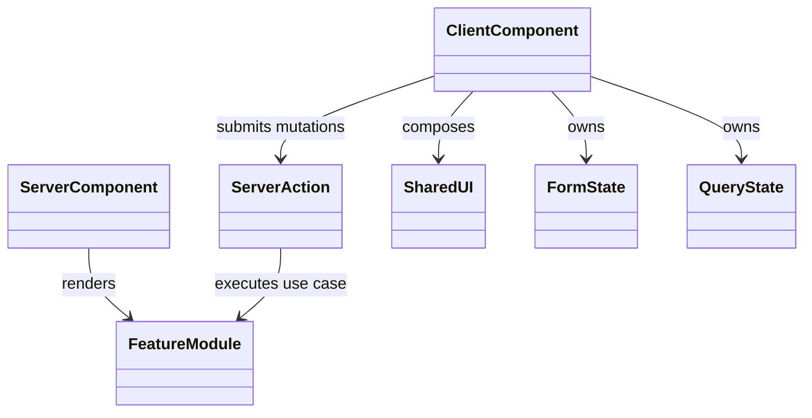

This keeps state local where possible and keeps server actions as the mutation
boundary instead of a global client store.

## Performance Strategy

- Prefer server-side rendering and data fetching.
- Paginate large lists and reports.
- Push search and filtering to the database.
- Select only the columns needed for the current view.
- Revalidate cached server data when mutations succeed.
- Lazy load heavy charts and infrequently used screens.
- Avoid repeated queries and N+1 access patterns.

### Performance Flow

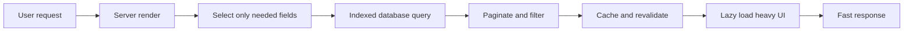

The strategy reduces round-trips, avoids over-fetching, and keeps the visible
surface responsive.

## Scalability Strategy

- Keep feature boundaries independent.
- Keep the authorization model flexible enough for future roles.
- Keep notification delivery behind an adapter boundary.
- Keep reporting read-only so it can scale without duplicating business rules.
- Keep the architecture compatible with future multi-academy expansion without
  forcing it into the current single-academy baseline.

### Scalability Flow

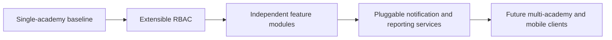

The architecture scales by adding isolated modules and service adapters instead of
reshaping the whole system.

## Deployment Strategy

- Production runs on Vercel.
- Local development and repeatable integration checks run through Docker Compose.
- Supabase remains the managed auth and PostgreSQL provider.
- Environment variables are validated at startup.
- Health checks remain lightweight and can be used by the deployment platform.

## Diagrams

### 1. System Architecture Diagram

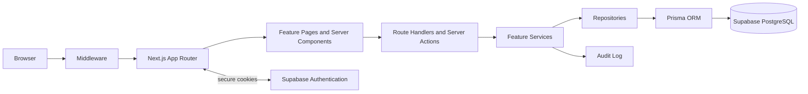

This view shows the end-to-end request path and where control moves from the
browser into the trusted server side.

### 2. Component Diagram

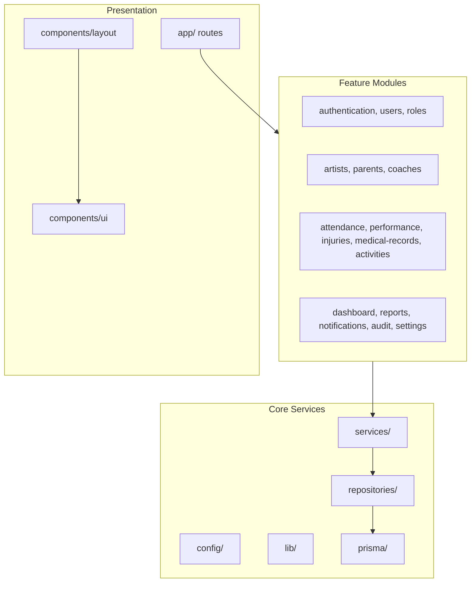

This diagram separates shared primitives from feature-owned code and shows that
shared services and repositories remain infrastructure boundaries, not business
logic buckets.

### 3. Deployment Diagram

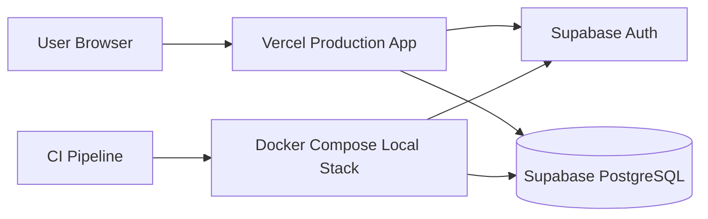

This diagram shows the production and local environments while keeping the public
surface limited to the Next.js application.

### 4. Context Diagram

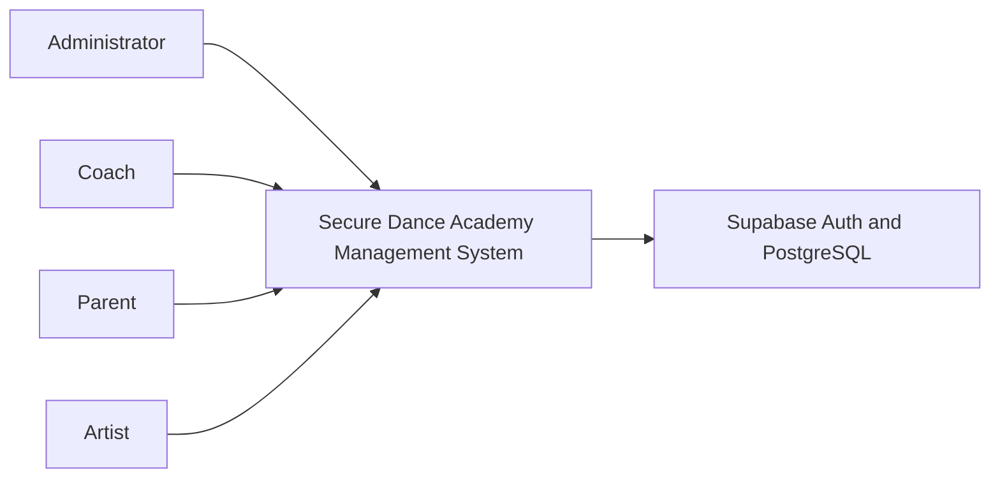

This diagram shows the actors that interact with the system and the managed
platform services it depends on.

### 5. Container Diagram

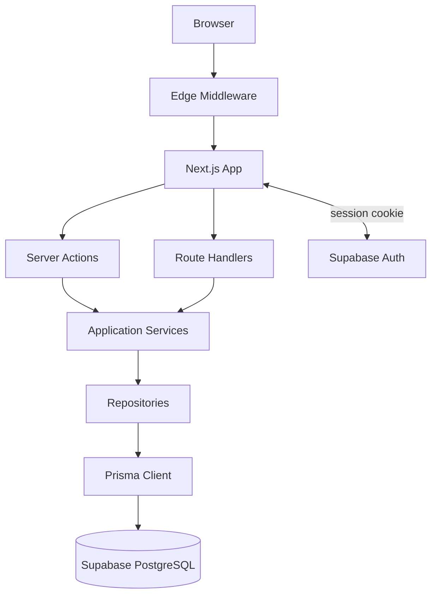

This diagram focuses on the runtime containers inside the web application and the
managed services they depend on.

### 6. Data Flow Diagram

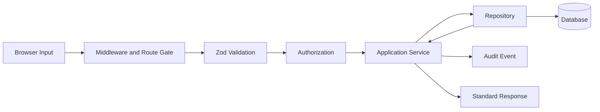

This diagram shows how untrusted input is transformed into validated and
authorized work before it reaches the database.

### 7. Trust Boundary Diagram

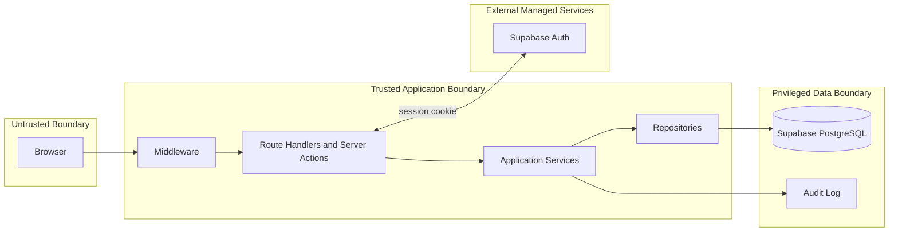

This diagram makes the security model explicit: the browser is untrusted, the
server is trusted only after validation and authorization, and the database is a
privileged boundary.

### 8. Authentication Sequence Diagram

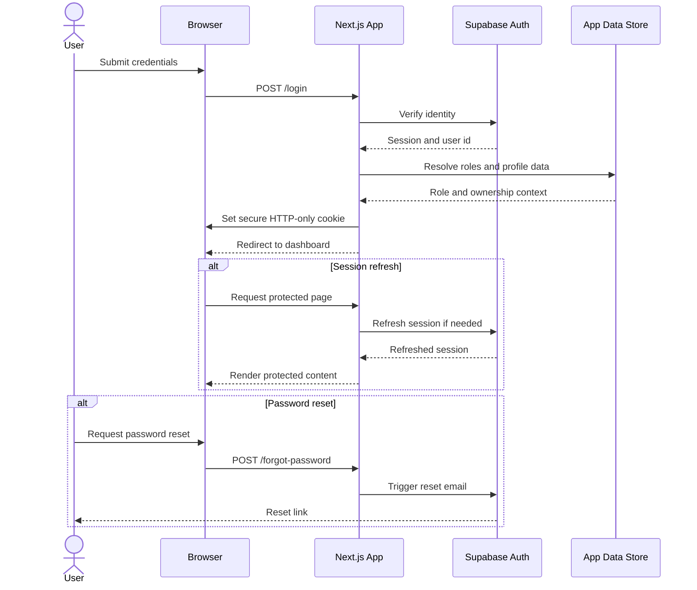

This diagram covers login, refresh, and password recovery on the same secure
session boundary.

### 9. Authorization Sequence Diagram

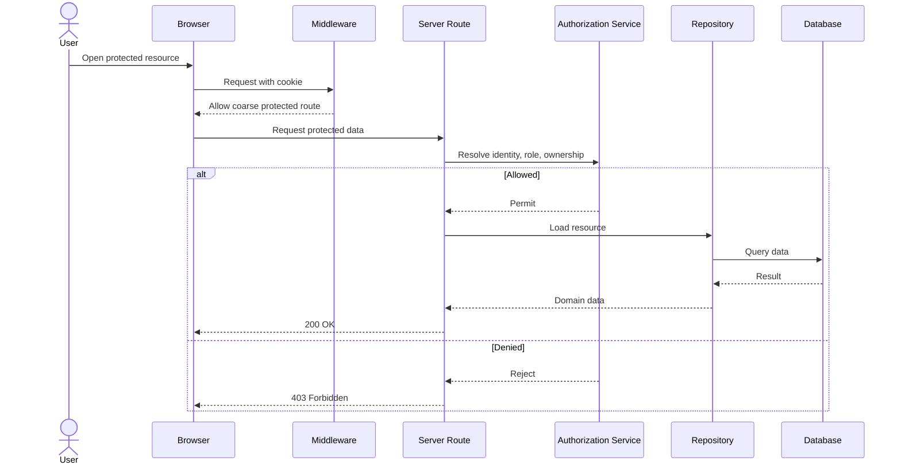

This diagram shows that authorization is a server-side decision and that the
frontend only improves usability.

## Architecture Decision Index

| ADR | Decision |
| --- | --- |
| `docs/decisions/0001-project-initialization.md` | Project initialization foundation. |
| `docs/decisions/0002-feature-based-clean-architecture.md` | Feature-based clean architecture and inward dependencies. |
| `docs/decisions/0003-supabase-auth-secure-cookie-sessions.md` | Supabase Auth with secure cookie sessions and controlled onboarding. |
| `docs/decisions/0004-prisma-repository-data-layer.md` | Prisma repository pattern over normalized PostgreSQL. |
| `docs/decisions/0005-server-components-first-ui-strategy.md` | Server Components first, client islands only when required. |
| `docs/decisions/0006-security-middleware-validation-audit.md` | Security middleware, server validation, rate limiting, and immutable audit logging. |
| `docs/decisions/0007-vercel-docker-deployment-boundary.md` | Vercel production deployment with Docker Compose local parity. |

## Open Design Items

These remain intentionally open because the approved requirements baseline does not
fix them yet:

- Notification delivery provider.
- Backup automation provider and schedule.
- Analytics dashboard depth.
- Multi-language support.
- Dark mode support.

The architecture leaves room for them without forcing a redesign.

## Architecture Review Checklist

- Module boundaries are clear and independent.
- Business logic stays out of UI components.
- Database access stays out of presentation code.
- Authentication and authorization are enforced server-side.
- Security boundaries are explicit.
- Diagrams match the documented architecture.
- Future expansion remains possible without redesign.
- The architecture aligns with the approved requirements baseline.
