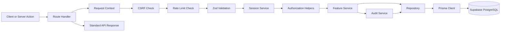

# Backend Foundation

Status: Task 08 complete

This document describes the backend foundation implemented for the Secure Dance
Academy Management System. It follows the approved architecture, the Prisma data
layer decision, the secure-cookie Supabase auth decision, and the security
hardening added in Task 08.

## Scope

The backend foundation provides:

- Feature-based module boundaries.
- Supabase server-client integration.
- Session resolution and RBAC helpers.
- Authorization helpers for role, ownership, and account-state checks.
- Standard API response envelopes.
- Request parsing, validation, and CSRF checks for mutating routes.
- Route and service level rate limiting for authentication and sensitive data flows.
- Security headers and cookie normalization through shared config.
- Audit logging and security logging.
- Prisma-backed repositories and transactional updates.
- Initial auth, profile, users, and audit route handlers.
- Server actions for auth and current-user profile workflows.

## Code Map

| Area | Files |
| --- | --- |
| HTTP primitives | `lib/http/errors.ts`, `lib/http/request-context.ts`, `lib/http/route-handler.ts` |
| Auth primitives | `lib/auth/rbac.ts`, `lib/auth/authorization.ts` |
| Security primitives | `lib/security/cookies.ts`, `lib/security/csrf.ts`, `lib/security/logger.ts`, `lib/security/rate-limit.ts`, `lib/security/sanitize.ts`, `lib/security/audit.ts` |
| Validation primitives | `lib/validation/primitives.ts`, `lib/validation/request.ts` |
| Prisma access | `lib/prisma.ts`, `repositories/base.repository.ts` |
| Authentication feature | `features/authentication/*` |
| Users feature | `features/users/*` |
| Audit feature | `features/audit/*` |
| Route handlers | `app/api/auth/*`, `app/api/me/route.ts`, `app/api/users/*`, `app/api/audit/route.ts`, `app/api/health/route.ts` |

## Request Flow

## Major Decisions

### Supabase auth with secure cookies

The backend uses the approved Supabase session model with secure HTTP-only
cookies, matching ADR 0003.

### Prisma repositories only

All persistence lives behind repositories, matching ADR 0004. Route handlers and
services never reach into Prisma directly.

### Security checks live on the server

CSRF protection, request validation, RBAC, ownership checks, rate limiting, and
audit emission are all server-side concerns, matching ADR 0006 and the approved
security requirements baseline.

### Feature-owned services

Authentication, users, and audit are implemented as feature-owned modules so the
backend stays easy to extend without collapsing into a single service bucket.

### Route handlers stay thin

Handlers only parse input, resolve the current session, call a feature service,
and return a standardized response. Business logic stays in the service layer.

## Implemented API Surface

### Auth

- `GET /api/auth/session`
- `POST /api/auth/login`
- `POST /api/auth/logout`
- `POST /api/auth/forgot-password`
- `POST /api/auth/reset-password`

### User profile

- `GET /api/me`

### Users

- `GET /api/users`
- `GET /api/users/[id]`
- `PATCH /api/users/[id]`
- `DELETE /api/users/[id]`

### Audit

- `GET /api/audit`

### Health

- `GET /api/health`

## Validation And Security Notes

- All mutating routes use same-origin checks.
- Sensitive flows are rate limited before the feature service runs.
- All route handlers return standardized success and error envelopes.
- Sensitive actions emit audit records with actor, request, entity, and outcome
  fields.
- Logging redacts obvious secrets before payloads reach the console.
- Supabase cookies are normalized to secure defaults when server code writes them.
- Security headers are centralized so route files do not duplicate browser
  hardening rules.

## Test Coverage

Backend unit tests currently cover:

- RBAC helpers.
- Authorization helpers and account-state checks.
- CSRF origin validation.
- Rate limit helpers.
- Secure cookie helpers.
- Security header generation.
- Sanitization helpers.
- API response helpers.
- Request validation helpers.
- Route handler error mapping.
