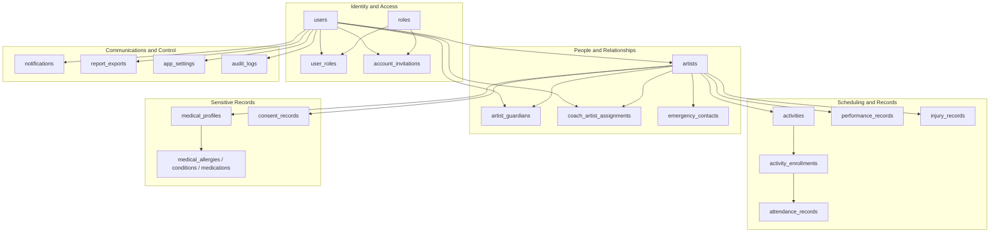
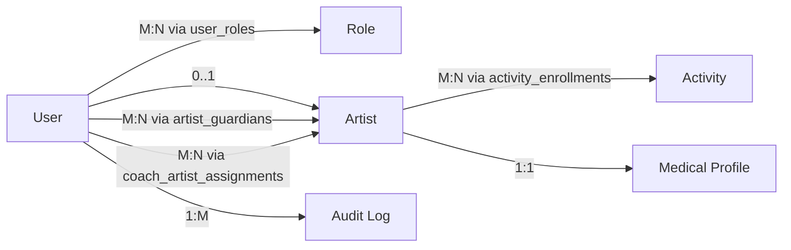
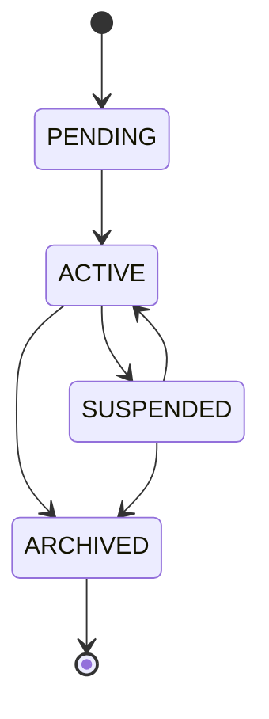
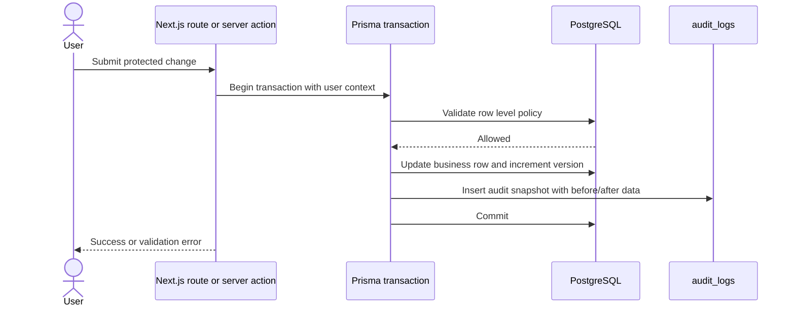
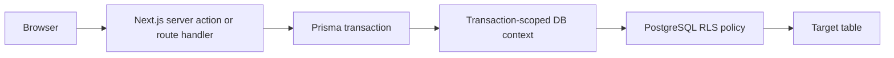
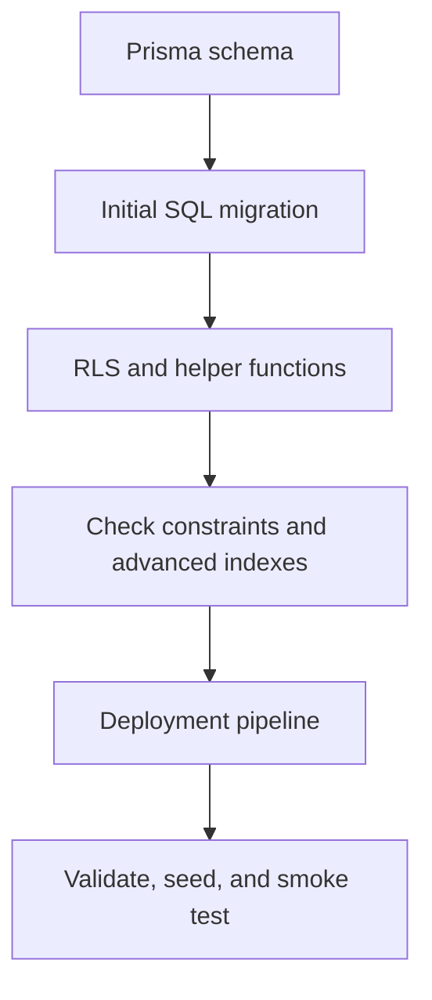
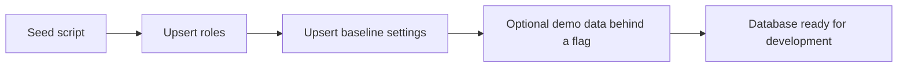
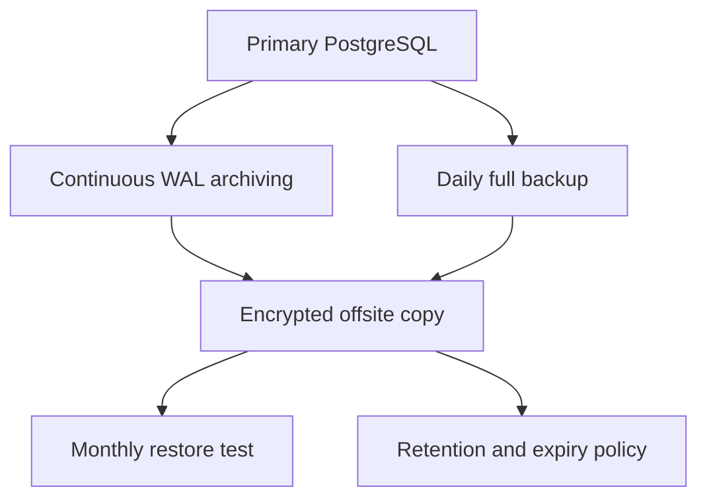

# Database Design

Status: Task 04 complete, awaiting approval

This document defines the production database for the Secure Dance Academy Management
System. It refines the approved architecture into a normalized PostgreSQL schema,
Prisma models, RLS policy design, and operational database practices.

The main design choices are:

- One `users` table for application accounts linked to Supabase Auth. [FR-01,
  FR-03, FR-04, FR-19, SR-01, SR-03, ADR 0003, ADR 0004]
- One `artists` table for performer profiles, with optional linked user accounts for
  adult artists. [BR-01, BR-03, FR-06, FR-07, FR-08, BRULE-01, BRULE-02,
  BRULE-07, ADR 0002, ADR 0004]
- Parent and coach access modeled as role-backed `users` plus relationship tables,
  not as separate parent or coach profile tables. [FR-03, FR-06, FR-07, FR-08,
  SR-02, SR-09, BRULE-01, BRULE-02, ADR 0002, ADR 0004]
- Child and medical data kept in dedicated tables with tighter access control.
  [BR-02, FR-11, FR-12, FR-15, FR-16, SR-09, PR-02, PR-03, BRULE-04, ADR 0006]
- Historical records preserved through versioning and audit logging instead of
  denormalized duplicate profiles. [BR-05, BR-09, FR-17, SR-07, PR-05, PR-06,
  PR-08, BRULE-05, ADR 0004, ADR 0006]

## Design Principles

- Normalize repeating groups into relationship tables and child tables. [BR-01,
  FR-06, FR-07, FR-08, BRULE-03, BRULE-07, ADR 0002, ADR 0004]
- Keep identity, access, people, scheduling, sensitive records, and audit history
  separate. [BR-02, FR-15, FR-16, FR-17, SR-09, PR-02, PR-03, ADR 0006]
- Treat audit logs as append-only evidence, not as mutable application data.
  [BR-05, FR-17, SR-07, PR-08, ADR 0004, ADR 0006]
- Use composite keys where the business relationship is the identity. [BR-01,
  FR-09, FR-18, BRULE-03, BRULE-07, ADR 0002, ADR 0004]
- Prefer status transitions over hard deletes for operational records. [BR-09,
  FR-17, PR-05, PR-06, LR-04, BRULE-05, ADR 0004]
- Keep Prisma as the schema contract and PostgreSQL as the enforcement layer.
  [ADR 0004, ADR 0006, ADR 0007]

## Decision Traceability

| Decision | Approved requirements | ADRs |
| --- | --- | --- |
| Identity records use `users` plus Supabase Auth linkage. | FR-01, FR-03, FR-04, FR-19, SR-01, SR-03 | ADR 0003, ADR 0004 |
| Performer profiles use a single normalized `artists` table. | BR-01, BR-03, FR-06, FR-07, FR-08, BRULE-01, BRULE-02, BRULE-07 | ADR 0002, ADR 0004 |
| Parent and coach access is represented through relationship tables. | FR-03, FR-06, FR-07, FR-08, SR-02, SR-09, BRULE-01, BRULE-02 | ADR 0002, ADR 0004 |
| Sensitive child and medical records are split into dedicated tables. | BR-02, FR-11, FR-12, FR-15, FR-16, SR-09, PR-02, PR-03, BRULE-04 | ADR 0006 |
| Attendance, performance, injury, consent, and audit data are versioned or immutable. | BR-05, BR-09, FR-17, SR-07, PR-05, PR-06, PR-08, BRULE-05 | ADR 0004, ADR 0006 |
| RLS helper functions enforce least-privilege access at the database layer. | FR-03, FR-15, FR-16, FR-17, SR-02, SR-09, SR-12, PR-07, BRULE-10 | ADR 0003, ADR 0006 |
| Seed data only creates approved reference data. | BR-11, FR-22, SR-01, SR-08 | ADR 0003, ADR 0004 |
| Migration and backup strategy preserve recoverability and audit history. | BR-05, BR-09, FR-17, SR-07, PR-05, PR-06, LR-04 | ADR 0004, ADR 0007 |
| PostgreSQL indexing targets the approved list, search, and authorization paths. | BR-06, BR-07, BR-10, FR-06, FR-09, FR-15, FR-16, FR-18, BRULE-10 | ADR 0004 |

## Conceptual Map

The conceptual model keeps the academy workflow centered on people and records
instead of permissions baked into profile tables.

## Logical ERD

Logical meaning:

- One account can hold multiple roles.
- One performer profile can be linked to one account or remain a protected dependent
  profile.
- Parents and coaches are access relationships, not separate identity tables.
- Activities connect to artists through enrollment records.
- Medical data is attached to an artist profile and split into normalized child
  tables.

## Physical ERD

```mermaid
classDiagram
  class User {
    uuid id PK
    uuid supabase_user_id UK
    string email UK
    UserStatus status
    datetime archived_at
  }

  class Role {
    uuid id PK
    string code UK
    boolean is_system
  }

  class UserRole {
    uuid user_id PK/FK
    uuid role_id PK/FK
    LinkStatus status
    uuid granted_by_user_id FK
  }

  class Artist {
    uuid id PK
    uuid user_id UK/FK
    string legal_first_name
    string legal_last_name
    RecordStatus status
  }

  class ArtistGuardian {
    uuid artist_id PK/FK
    uuid guardian_user_id PK/FK
    RelationshipType relationship_type
    LinkStatus status
  }

  class CoachArtistAssignment {
    uuid artist_id PK/FK
    uuid coach_user_id PK/FK
    LinkStatus status
  }

  class Activity {
    uuid id PK
    ActivityKind kind
    ActivityStatus status
    datetime starts_at
    datetime ends_at
  }

  class ActivityEnrollment {
    uuid activity_id PK/FK
    uuid artist_id PK/FK
    EnrollmentStatus status
  }

  class AttendanceRecord {
    uuid id PK
    uuid activity_id FK
    uuid artist_id FK
    AttendanceStatus status
  }

  class PerformanceRecord {
    uuid id PK
    uuid artist_id FK
    uuid activity_id FK
    PerformanceKind kind
  }

  class InjuryRecord {
    uuid id PK
    uuid artist_id FK
    uuid activity_id FK
    InjuryStatus status
  }

  class MedicalProfile {
    uuid id PK
    uuid artist_id UK/FK
    RecordStatus status
  }

  class MedicalAllergy {
    uuid id PK
    uuid medical_profile_id FK
    SeverityLevel severity
  }

  class MedicalCondition {
    uuid id PK
    uuid medical_profile_id FK
    SeverityLevel severity
  }

  class MedicalMedication {
    uuid id PK
    uuid medical_profile_id FK
  }

  class EmergencyContact {
    uuid id PK
    uuid artist_id FK
    RecordStatus status
  }

  class ConsentRecord {
    uuid id PK
    uuid artist_id FK
    ConsentScope scope
    ConsentStatus status
  }

  class Notification {
    uuid id PK
    uuid recipient_user_id FK
    NotificationStatus status
  }

  class ReportExport {
    uuid id PK
    uuid requested_by_user_id FK
    ExportStatus status
  }

  class AppSetting {
    SettingScope scope PK
    string setting_key PK
  }

  class AccountInvitation {
    uuid id PK
    uuid invited_role_id FK
    uuid invited_by_user_id FK
    uuid target_artist_id FK
    InvitationStatus status
  }

  class AuditLog {
    bigint id PK
    uuid actor_user_id FK
    AuditOutcome outcome
  }

  User "1" --> "0..*" UserRole
  Role "1" --> "0..*" UserRole
  User "0..1" --> "0..*" Artist
  Artist "1" --> "0..*" ArtistGuardian
  User "1" --> "0..*" ArtistGuardian
  Artist "1" --> "0..*" CoachArtistAssignment
  User "1" --> "0..*" CoachArtistAssignment
  Activity "1" --> "0..*" ActivityEnrollment
  Artist "1" --> "0..*" ActivityEnrollment
  ActivityEnrollment "1" --> "0..1" AttendanceRecord
  Artist "1" --> "0..*" PerformanceRecord
  Activity "0..1" --> "0..*" PerformanceRecord
  Artist "1" --> "0..*" InjuryRecord
  Activity "0..1" --> "0..*" InjuryRecord
  Artist "1" --> "0..1" MedicalProfile
  MedicalProfile "1" --> "0..*" MedicalAllergy
  MedicalProfile "1" --> "0..*" MedicalCondition
  MedicalProfile "1" --> "0..*" MedicalMedication
  Artist "1" --> "0..*" EmergencyContact
  Artist "1" --> "0..*" ConsentRecord
  User "1" --> "0..*" Notification
  User "0..1" --> "0..*" ReportExport
  Role "1" --> "0..*" AccountInvitation
  User "0..1" --> "0..*" AccountInvitation
  Artist "0..1" --> "0..*" AccountInvitation
  User "0..1" --> "0..*" AuditLog
```

The physical model uses UUID primary keys for business tables and a bigint identity
for audit logs to keep append-only writes efficient.

## Mermaid ER Diagram

```mermaid
erDiagram
  USERS ||--o{ USER_ROLES : has
  ROLES ||--o{ USER_ROLES : grants
  USERS ||--o| ARTISTS : owns
  ARTISTS ||--o{ ARTIST_GUARDIANS : linked_to
  USERS ||--o{ ARTIST_GUARDIANS : guardian_account
  ARTISTS ||--o{ COACH_ARTIST_ASSIGNMENTS : coached_by
  USERS ||--o{ COACH_ARTIST_ASSIGNMENTS : coach_account
  ACTIVITIES ||--o{ ACTIVITY_ENROLLMENTS : includes
  ARTISTS ||--o{ ACTIVITY_ENROLLMENTS : enrolled_in
  ACTIVITY_ENROLLMENTS ||--o| ATTENDANCE_RECORDS : produces
  ARTISTS ||--o{ PERFORMANCE_RECORDS : receives
  ACTIVITIES ||--o{ PERFORMANCE_RECORDS : context_for
  ARTISTS ||--o{ INJURY_RECORDS : affected_by
  ACTIVITIES ||--o{ INJURY_RECORDS : context_for
  ARTISTS ||--o| MEDICAL_PROFILES : owns
  MEDICAL_PROFILES ||--o{ MEDICAL_ALLERGIES : lists
  MEDICAL_PROFILES ||--o{ MEDICAL_CONDITIONS : lists
  MEDICAL_PROFILES ||--o{ MEDICAL_MEDICATIONS : lists
  ARTISTS ||--o{ EMERGENCY_CONTACTS : lists
  ARTISTS ||--o{ CONSENT_RECORDS : grants_for
  USERS ||--o{ NOTIFICATIONS : receives
  USERS ||--o{ REPORT_EXPORTS : requests
  USERS ||--o{ AUDIT_LOGS : acts
  USERS ||--o{ APP_SETTINGS : updates
  USERS ||--o{ ACCOUNT_INVITATIONS : sends
  ROLES ||--o{ ACCOUNT_INVITATIONS : targets

  USERS {
    uuid id PK
    uuid supabase_user_id
    string email
    string display_name
    string status
  }
  ROLES {
    uuid id PK
    string code
    string name
  }
  USER_ROLES {
    uuid user_id PK
    uuid role_id PK
    string status
  }
  ARTISTS {
    uuid id PK
    uuid user_id
    string legal_first_name
    string legal_last_name
    string status
  }
  ARTIST_GUARDIANS {
    uuid artist_id PK
    uuid guardian_user_id PK
    string relationship_type
    string status
  }
  COACH_ARTIST_ASSIGNMENTS {
    uuid artist_id PK
    uuid coach_user_id PK
    string status
  }
  ACTIVITIES {
    uuid id PK
    string title
    string kind
    string status
  }
  ACTIVITY_ENROLLMENTS {
    uuid activity_id PK
    uuid artist_id PK
    string status
  }
  ATTENDANCE_RECORDS {
    uuid id PK
    uuid activity_id FK
    uuid artist_id FK
    string status
  }
  PERFORMANCE_RECORDS {
    uuid id PK
    uuid artist_id FK
    uuid activity_id FK
    string kind
  }
  INJURY_RECORDS {
    uuid id PK
    uuid artist_id FK
    uuid activity_id FK
    string status
  }
  MEDICAL_PROFILES {
    uuid id PK
    uuid artist_id
    string status
  }
  MEDICAL_ALLERGIES {
    uuid id PK
    uuid medical_profile_id FK
    string allergen_name
    string status
  }
  MEDICAL_CONDITIONS {
    uuid id PK
    uuid medical_profile_id FK
    string condition_name
    string status
  }
  MEDICAL_MEDICATIONS {
    uuid id PK
    uuid medical_profile_id FK
    string medication_name
    string status
  }
  EMERGENCY_CONTACTS {
    uuid id PK
    uuid artist_id FK
    string contact_name
    string status
  }
  CONSENT_RECORDS {
    uuid id PK
    uuid artist_id FK
    string scope
    string status
  }
  NOTIFICATIONS {
    uuid id PK
    uuid recipient_user_id FK
    string status
  }
  REPORT_EXPORTS {
    uuid id PK
    uuid requested_by_user_id FK
    string status
  }
  APP_SETTINGS {
    string scope PK
    string setting_key PK
  }
  ACCOUNT_INVITATIONS {
    uuid id PK
    uuid invited_role_id FK
    uuid invited_by_user_id FK
    uuid target_artist_id FK
    string status
  }
  AUDIT_LOGS {
    bigint id PK
    uuid actor_user_id FK
    string action
    string outcome
  }
```

## Entities, Attributes, and Cardinality

### Identity And Access

| Entity | Purpose | Key attributes |
| --- | --- | --- |
| `users` | Application account linked to Supabase Auth. | `supabase_user_id`, `email`, `display_name`, `status`, `archived_at`, `anonymized_at`, `version` |
| `roles` | RBAC reference table. | `code`, `name`, `description`, `is_system` |
| `user_roles` | Role grant join table. | `user_id`, `role_id`, `status`, `granted_at`, `revoked_at`, `granted_by_user_id` |
| `account_invitations` | Controlled onboarding and approval workflow. | `email`, `invited_role_id`, `token_hash`, `status`, `expires_at`, `accepted_at`, `target_artist_id` |
| `app_settings` | Scoped configuration values. | `scope`, `setting_key`, `setting_value`, `is_sensitive`, `updated_by_user_id`, `version` |
| `audit_logs` | Immutable accountability trail. | `actor_user_id`, `actor_user_email`, `actor_display_name`, `action`, `entity_type`, `entity_id`, `outcome`, `before_data`, `after_data`, `metadata` |

### People And Relationships

| Entity | Purpose | Key attributes |
| --- | --- | --- |
| `artists` | Performer profile. | `user_id`, `legal_first_name`, `legal_last_name`, `preferred_name`, `stage_name`, `date_of_birth`, `status`, `archived_at`, `version` |
| `artist_guardians` | Parent/guardian link. | `artist_id`, `guardian_user_id`, `relationship_type`, `status`, `is_primary`, `granted_at`, `revoked_at` |
| `coach_artist_assignments` | Coach-to-artist access link. | `artist_id`, `coach_user_id`, `status`, `is_primary`, `assigned_at`, `revoked_at` |
| `emergency_contacts` | Artist emergency contact data. | `artist_id`, `contact_name`, `relationship_type`, `phone`, `email`, `priority_order`, `is_primary`, `status` |

### Operations And Compliance

| Entity | Purpose | Key attributes |
| --- | --- | --- |
| `activities` | Scheduled class, rehearsal, performance, event, or meeting. | `title`, `kind`, `starts_at`, `ends_at`, `location`, `timezone`, `capacity`, `status`, `archived_at` |
| `activity_enrollments` | Roster of artists assigned to activities. | `activity_id`, `artist_id`, `status`, `enrolled_at`, `withdrawn_at`, `completed_at`, `assigned_by_user_id` |
| `attendance_records` | Attendance per activity and artist. | `activity_id`, `artist_id`, `status`, `check_in_at`, `check_out_at`, `recorded_by_user_id`, `recorded_at`, `notes`, `version` |
| `performance_records` | Performance or assessment history. | `artist_id`, `activity_id`, `kind`, `performed_at`, `score`, `recorded_by_user_id`, `notes`, `version` |
| `injury_records` | Injury and recovery tracking. | `artist_id`, `activity_id`, `incident_at`, `severity`, `status`, `description`, `immediate_action`, `recovery_summary`, `follow_up_due_at` |
| `consent_records` | Consent evidence and lifecycle. | `artist_id`, `scope`, `status`, `granted_by_user_id`, `recorded_by_user_id`, `granted_at`, `revoked_at`, `expires_at`, `policy_version` |

### Sensitive Health Data

| Entity | Purpose | Key attributes |
| --- | --- | --- |
| `medical_profiles` | One per artist, holds current protected health summary. | `artist_id`, `primary_physician_name`, `primary_physician_phone`, `medical_notes`, `emergency_instructions`, `status`, `archived_at`, `version` |
| `medical_allergies` | Allergy list. | `medical_profile_id`, `allergen_name`, `reaction`, `severity`, `status`, `archived_at`, `version` |
| `medical_conditions` | Condition list. | `medical_profile_id`, `condition_name`, `diagnosed_at`, `severity`, `status`, `archived_at`, `version` |
| `medical_medications` | Medication list. | `medical_profile_id`, `medication_name`, `dosage`, `schedule`, `prescribed_by`, `status`, `archived_at`, `version` |

### Communications And Reporting

| Entity | Purpose | Key attributes |
| --- | --- | --- |
| `notifications` | In-app and email delivery queue. | `recipient_user_id`, `created_by_user_id`, `category`, `title`, `body`, `payload`, `channel`, `status`, `sent_at`, `delivered_at`, `read_at`, `expires_at` |
| `report_exports` | Export job tracking and retention. | `requested_by_user_id`, `report_type`, `filters`, `format`, `status`, `storage_key`, `file_name`, `row_count`, `expires_at`, `completed_at` |

## Relationships And Cardinality

| From | To | Cardinality | Enforcement |
| --- | --- | --- | --- |
| `users` | `user_roles` | 1 to many | Composite PK on `user_roles` plus FK to `users`. |
| `roles` | `user_roles` | 1 to many | FK to `roles.code` and unique role code. |
| `users` | `artists` | 0 or 1 to many | Optional `artists.user_id` supports adult artist accounts. |
| `artists` | `artist_guardians` | 1 to many | Join table for dependent profiles. |
| `users` | `artist_guardians` | 1 to many | Guardian account access. |
| `artists` | `coach_artist_assignments` | 1 to many | Join table for coach access. |
| `users` | `coach_artist_assignments` | 1 to many | Assigned coach account access. |
| `activities` | `activity_enrollments` | 1 to many | Activity roster. |
| `artists` | `activity_enrollments` | 1 to many | Artist roster membership. |
| `activity_enrollments` | `attendance_records` | 0 or 1 to many | Attendance keyed by activity and artist pair. |
| `artists` | `performance_records` | 1 to many | Artist performance history. |
| `artists` | `injury_records` | 1 to many | Artist safety history. |
| `artists` | `medical_profiles` | 0 or 1 to 1 | One current medical profile per artist. |
| `medical_profiles` | `medical_allergies` | 1 to many | Repeating values normalized. |
| `medical_profiles` | `medical_conditions` | 1 to many | Repeating values normalized. |
| `medical_profiles` | `medical_medications` | 1 to many | Repeating values normalized. |
| `artists` | `emergency_contacts` | 1 to many | Contact list per artist. |
| `artists` | `consent_records` | 1 to many | Consent evidence is per artist. |
| `users` | `notifications` | 1 to many | Recipient queue. |
| `users` | `report_exports` | 1 to many | Export request tracking. |
| `users` | `audit_logs` | 0 or 1 to many | Actor snapshot plus immutable history. |

## Constraints

### Primary And Unique Constraints

| Constraint | Table | Purpose |
| --- | --- | --- |
| `users.id` | `users` | Surrogate primary key. |
| `users.supabase_user_id` | `users` | One application account per Supabase identity. |
| `users.email` | `users` | One active email per account; anonymization updates the address before purge. |
| `roles.code` | `roles` | Stable RBAC codes. |
| `user_roles(user_id, role_id)` | `user_roles` | One assignment row per user-role pair. |
| `artists.user_id` | `artists` | Optional one-to-one link for adult artist accounts. |
| `artist_guardians(artist_id, guardian_user_id)` | `artist_guardians` | One guardian link per pair. |
| `coach_artist_assignments(artist_id, coach_user_id)` | `coach_artist_assignments` | One coach link per pair. |
| `activity_enrollments(activity_id, artist_id)` | `activity_enrollments` | One roster entry per pair. |
| `attendance_records(activity_id, artist_id)` | `attendance_records` | One attendance row per activity and artist. |
| `medical_profiles.artist_id` | `medical_profiles` | One medical profile per artist. |
| `medical_allergies(medical_profile_id, allergen_name)` | `medical_allergies` | Prevent repeated allergy rows. |
| `medical_conditions(medical_profile_id, condition_name)` | `medical_conditions` | Prevent repeated condition rows. |
| `medical_medications(medical_profile_id, medication_name)` | `medical_medications` | Prevent repeated medication rows. |
| `emergency_contacts(artist_id, priority_order)` | `emergency_contacts` | Stable contact ordering. |
| `app_settings(scope, setting_key)` | `app_settings` | Scoped configuration identity. |
| `account_invitations.token_hash` | `account_invitations` | Prevent token reuse. |
| `audit_logs.id` | `audit_logs` | Monotonic append-only identity. |

### Check Constraints And Business Rules

| Rule | Enforcement |
| --- | --- |
| `activities.ends_at > activities.starts_at` | Database check constraint in migration plus application validation. |
| `attendance_records` must reference an enrolled artist for the same activity | Composite FK to `activity_enrollments(activity_id, artist_id)`. |
| Role changes require audit logging | Application transaction writes `audit_logs` row before commit. |
| Child artist profiles must have at least one guardian relationship | Application validation plus RLS. |
| Medical data is visible only to approved roles | RLS policy and helper functions. |
| Notifications must not contain hidden medical payloads | Application sanitization and schema review. |
| Version numbers increase on each update | Service layer optimistic locking. |

## Foreign Keys

| Table | Foreign key | Action |
| --- | --- | --- |
| `user_roles` | `user_id -> users.id` | `ON DELETE CASCADE` |
| `user_roles` | `role_id -> roles.id` | `ON DELETE RESTRICT` |
| `user_roles` | `granted_by_user_id -> users.id` | `ON DELETE SET NULL` |
| `artists` | `user_id -> users.id` | `ON DELETE SET NULL` |
| `artist_guardians` | `artist_id -> artists.id` | `ON DELETE CASCADE` |
| `artist_guardians` | `guardian_user_id -> users.id` | `ON DELETE CASCADE` |
| `artist_guardians` | `granted_by_user_id -> users.id` | `ON DELETE SET NULL` |
| `coach_artist_assignments` | `artist_id -> artists.id` | `ON DELETE CASCADE` |
| `coach_artist_assignments` | `coach_user_id -> users.id` | `ON DELETE CASCADE` |
| `coach_artist_assignments` | `assigned_by_user_id -> users.id` | `ON DELETE SET NULL` |
| `activity_enrollments` | `activity_id -> activities.id` | `ON DELETE CASCADE` |
| `activity_enrollments` | `artist_id -> artists.id` | `ON DELETE CASCADE` |
| `activity_enrollments` | `assigned_by_user_id -> users.id` | `ON DELETE SET NULL` |
| `attendance_records` | `(activity_id, artist_id) -> activity_enrollments(activity_id, artist_id)` | `ON DELETE RESTRICT` |
| `attendance_records` | `recorded_by_user_id -> users.id` | `ON DELETE SET NULL` |
| `performance_records` | `artist_id -> artists.id` | `ON DELETE RESTRICT` |
| `performance_records` | `activity_id -> activities.id` | `ON DELETE SET NULL` |
| `performance_records` | `recorded_by_user_id -> users.id` | `ON DELETE SET NULL` |
| `injury_records` | `artist_id -> artists.id` | `ON DELETE RESTRICT` |
| `injury_records` | `activity_id -> activities.id` | `ON DELETE SET NULL` |
| `injury_records` | `reported_by_user_id -> users.id` | `ON DELETE SET NULL` |
| `injury_records` | `reviewed_by_user_id -> users.id` | `ON DELETE SET NULL` |
| `medical_profiles` | `artist_id -> artists.id` | `ON DELETE CASCADE` |
| `medical_allergies` | `medical_profile_id -> medical_profiles.id` | `ON DELETE CASCADE` |
| `medical_conditions` | `medical_profile_id -> medical_profiles.id` | `ON DELETE CASCADE` |
| `medical_medications` | `medical_profile_id -> medical_profiles.id` | `ON DELETE CASCADE` |
| `emergency_contacts` | `artist_id -> artists.id` | `ON DELETE CASCADE` |
| `consent_records` | `artist_id -> artists.id` | `ON DELETE RESTRICT` |
| `consent_records` | `granted_by_user_id -> users.id` | `ON DELETE SET NULL` |
| `consent_records` | `recorded_by_user_id -> users.id` | `ON DELETE SET NULL` |
| `notifications` | `recipient_user_id -> users.id` | `ON DELETE CASCADE` |
| `notifications` | `created_by_user_id -> users.id` | `ON DELETE SET NULL` |
| `report_exports` | `requested_by_user_id -> users.id` | `ON DELETE SET NULL` |
| `app_settings` | `updated_by_user_id -> users.id` | `ON DELETE SET NULL` |
| `account_invitations` | `invited_role_id -> roles.id` | `ON DELETE RESTRICT` |
| `account_invitations` | `invited_by_user_id -> users.id` | `ON DELETE SET NULL` |
| `account_invitations` | `target_artist_id -> artists.id` | `ON DELETE SET NULL` |
| `account_invitations` | `accepted_by_user_id -> users.id` | `ON DELETE SET NULL` |
| `audit_logs` | `actor_user_id -> users.id` | `ON DELETE SET NULL` |

## Composite Keys

| Table | Composite key | Why it exists |
| --- | --- | --- |
| `user_roles` | `(user_id, role_id)` | A user can hold a role at most once. |
| `artist_guardians` | `(artist_id, guardian_user_id)` | One guardian link per artist-user pair. |
| `coach_artist_assignments` | `(artist_id, coach_user_id)` | One coach link per artist-user pair. |
| `activity_enrollments` | `(activity_id, artist_id)` | One roster entry per activity-artist pair. |
| `attendance_records` | `(activity_id, artist_id)` unique pair | One attendance row per enrolled pair. |
| `app_settings` | `(scope, setting_key)` | Scoped configuration identity. |
| `medical_allergies` | `(medical_profile_id, allergen_name)` | Prevent duplicate allergy rows. |
| `medical_conditions` | `(medical_profile_id, condition_name)` | Prevent duplicate condition rows. |
| `medical_medications` | `(medical_profile_id, medication_name)` | Prevent duplicate medication rows. |
| `emergency_contacts` | `(artist_id, priority_order)` unique pair | Stable ordering for contact lists. |

## Index Strategy

| Table | Index | Why |
| --- | --- | --- |
| `users` | `status`, `status + last_name + first_name` | Fast account lists and role-aware search. |
| `user_roles` | `role_id`, `granted_by_user_id`, `status` | Role resolution and admin review. |
| `artists` | `legal_last_name + legal_first_name`, `stage_name`, `status` | Directory and roster search. |
| `artist_guardians` | `guardian_user_id`, `granted_by_user_id`, `status` | Parent lookup and access checks. |
| `coach_artist_assignments` | `coach_user_id`, `assigned_by_user_id`, `status` | Coach access and admin review. |
| `activities` | `kind + starts_at`, `status + starts_at` | Schedule views and upcoming activity lists. |
| `activity_enrollments` | `artist_id`, `assigned_by_user_id`, `status` | Roster lookup and filtering. |
| `attendance_records` | `artist_id + recorded_at`, `status + recorded_at`, `recorded_by_user_id` | Attendance history and admin review. |
| `performance_records` | `artist_id + performed_at`, `activity_id`, `recorded_by_user_id` | Performer history and activity context. |
| `injury_records` | `artist_id + incident_at`, `activity_id`, `reported_by_user_id`, `reviewed_by_user_id`, `status + incident_at` | Safety reporting and review. |
| `medical_profiles` | `status` | Active medical profile lookup. |
| `medical_allergies` | `medical_profile_id`, `status` | Medical profile joins and active list reads. |
| `medical_conditions` | `medical_profile_id`, `status` | Medical profile joins and active list reads. |
| `medical_medications` | `medical_profile_id`, `status` | Medical profile joins and active list reads. |
| `emergency_contacts` | `artist_id + status` | Current contact list retrieval. |
| `consent_records` | `artist_id + scope`, `granted_by_user_id`, `recorded_by_user_id`, `status + granted_at` | Consent lookups and legal review. |
| `notifications` | `recipient_user_id + status + created_at`, `recipient_user_id + read_at`, `context_type + context_id`, `created_by_user_id` | Inbox, unread queue, and traceability. |
| `report_exports` | `requested_by_user_id + created_at`, `status + created_at` | Export queue and history. |
| `app_settings` | `updated_by_user_id` | Admin review. |
| `account_invitations` | `email + status`, `expires_at`, `invited_by_user_id`, `target_artist_id`, `accepted_by_user_id` | Controlled onboarding and token expiry cleanup. |
| `audit_logs` | `occurred_at`, `actor_user_id + occurred_at`, `entity_type + entity_id`, `action + occurred_at` | Append-only audit queries and investigations. |

Raw SQL migrations add partial indexes and any table-specific tuning that Prisma
cannot express directly, such as unread notification filters and optional active-row
optimizations.

## Soft Delete Strategy

- Use status-based archival for master records: `users`, `artists`, `activities`,
  `medical_profiles`, `medical_*`, `emergency_contacts`, and related lifecycle
  tables.
- Keep relationship tables as stateful links with `status`, `granted_at`,
  `revoked_at`, or `withdrawn_at` instead of deleting the row.
- Keep history tables immutable or append-only. `audit_logs` is never updated or
  deleted by application code.
- Use anonymization for user records when a privacy purge is required. The account
  row is archived and sensitive personal fields are replaced with non-identifying
  values before any final retention cleanup.

This lifecycle fits users and artist profiles. Relationship rows use a similar but
smaller active/revoked state model.

## Audit Strategy

- Every sensitive mutation writes a row to `audit_logs` in the same database
  transaction.
- Audit rows capture the actor snapshot, entity identity, outcome, request id,
  before/after snapshots, and optional metadata.
- `audit_logs` is append-only. Updates and deletes are blocked at the application
  layer and by database permissions.
- The audit table uses a bigint identity for write locality and efficient ordering.
- Audit records remain even if the related account is archived or anonymized.

## Versioning Strategy

- Each mutable business row has a `version` integer initialized to `1`.
- Updates increment `version` and include optimistic concurrency checks in the
  service layer.
- Audit rows store the version that was written for the entity.
- Historical records are not overwritten; corrected values create a new version or
  a status transition, depending on the table.
- Pure lookup tables such as `roles` and `app_settings` are versioned only when the
  business value changes.

## Row Level Security Design

RLS is enabled on all runtime tables. The database context is passed from the
application into PostgreSQL at the start of each Prisma transaction using custom
session settings.

### Context Functions

- `app.current_user_id()`
- `app.current_role_codes()`
- `app.is_admin()`
- `app.is_guardian_of(artist_id)`
- `app.is_coach_of(artist_id)`
- `app.is_artist_self(artist_id)`
- `app.can_access_artist(artist_id)`

### RLS Rules

| Table group | Allowed read access | Allowed write access |
| --- | --- | --- |
| `users`, `roles`, `user_roles` | Self and administrators for `users`; administrators for `roles` and `user_roles`. | Administrators only, except self-service profile updates on safe user fields. |
| `artists`, `artist_guardians`, `coach_artist_assignments`, `activity_enrollments` | Administrators; linked guardians; assigned coaches; artist self where applicable. | Administrators and approved workflow code paths only. |
| `activities`, `attendance_records`, `performance_records`, `injury_records` | Administrators; assigned coaches; linked guardians; artist self for own records. | Administrators and authorized operational roles only. |
| `medical_profiles`, `medical_allergies`, `medical_conditions`, `medical_medications` | Administrators; linked guardians; artist self. Coaches are excluded from full medical detail by default. | Administrators and approved guardian/self workflows only. |
| `emergency_contacts` | Administrators; linked guardians; artist self; assigned coaches for minimum necessary safety data. | Administrators and approved guardian/self workflows only. |
| `consent_records` | Administrators; linked guardians; artist self. | Administrators and approved guardian/self workflows only. |
| `notifications`, `report_exports` | Recipient or requesting user plus administrators. | System services and authorized application code only. |
| `app_settings`, `account_invitations`, `audit_logs` | Administrators and security reviewers. | Administrators or system services only. |

The application remains the first authorization gate. RLS is the database backstop
that prevents accidental overreach if a repository path is misused.

## Prisma Schema Design

The Prisma schema follows these rules:

- Singular model names with explicit table mapping to snake_case tables.
- UUID primary keys for business tables.
- A bigint identity for `audit_logs`.
- Composite IDs for relationship tables and scoped settings.
- Nullable foreign keys only where the business rule allows a missing link.
- JSON fields only for flexible payloads, export filters, settings values, and audit
  metadata.
- No denormalized parent profile tables for parents or coaches.
- Raw SQL migrations for database features that Prisma does not represent directly
  such as RLS, check constraints, partial indexes, and any future partitioning.

## PostgreSQL Optimization

- Use `uuid` keys for distributed-safe identifiers and `bigint` for the append-only
  audit table.
- Keep timestamps in `timestamptz` so audit and attendance records are timezone safe.
- Use `jsonb` only for flexible metadata and filters, not for core relational data.
- Index every foreign key used in joins or policy checks.
- Keep the write-heavy audit table append-only and consider monthly partitioning if
  volume grows.
- Consider partial indexes for active or unread rows where the filtered subset is
  much smaller than the table.
- Keep reusable lookup data tiny and static.

## Migration Strategy

- The initial migration creates the normalized tables and core constraints.
- A follow-up raw SQL migration enables RLS, helper functions, check constraints,
  and any partial or BRIN indexes.
- Future migrations use expand/contract patterns: add columns first, backfill data,
  switch reads, then remove old columns later.
- Destructive changes require a separate review because the database is the source
  of truth for regulated records.
- Seed and migration scripts are idempotent so local and CI environments converge to
  the same state.

## Seed Strategy

- Seed the four approved roles: administrator, coach, parent, and artist.
- Seed baseline application settings such as academy name, timezone, retention
  values, and password policy metadata.
- Do not seed sensitive personal data by default.
- Keep any demo fixtures behind an explicit flag so production-like seeds remain
  safe.
- Make the seed script idempotent with `upsert` and `createMany(skipDuplicates)` or
  equivalent logic.

## Backup Strategy

- Use encrypted backups with point-in-time recovery support.
- Keep at least one offsite copy outside the primary failure domain.
- Verify restores on a recurring schedule; a backup is not useful until it has been
  restored successfully.
- Retain audit history and regulated records according to the project retention
  policy rather than deleting them casually.
- Archive and purge only through controlled jobs that respect the legal retention
  rules.

## Validation Record

- Prisma schema validation passed after formatting and relation completion.
- Prisma client generation succeeded from the validated schema.
- A targeted search found no incomplete markers in the database deliverables
  themselves (`docs/database/README.md`, `prisma/schema.prisma`,
  `prisma/seed.ts`, `docs/index.md`).
- The seed script is idempotent and limited to approved reference data only.

## Review Notes

- Normalization review: repeating groups are split into join tables or child tables;
  parent and coach identities are not duplicated in profile tables.
- Security review: the RLS boundary is explicit, sensitive medical data is separated
  from general operational data, and audit logs are immutable.
- Index review: all foreign keys used in joins or policies are indexed, and the
  obvious list views have supporting composite indexes.
- Prisma review: the schema is aligned with the approved stack and leaves the few
  PostgreSQL-specific pieces to raw SQL migrations where Prisma has no native model.
