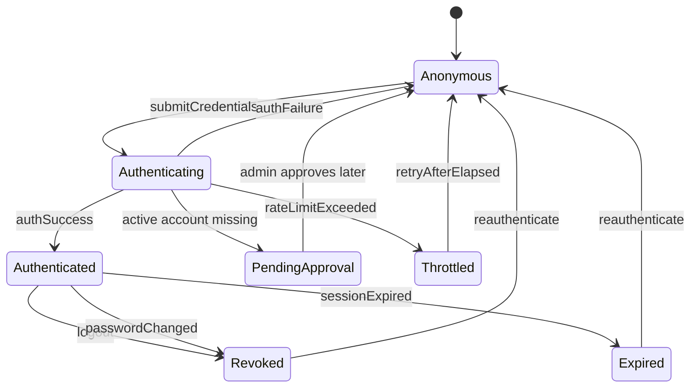
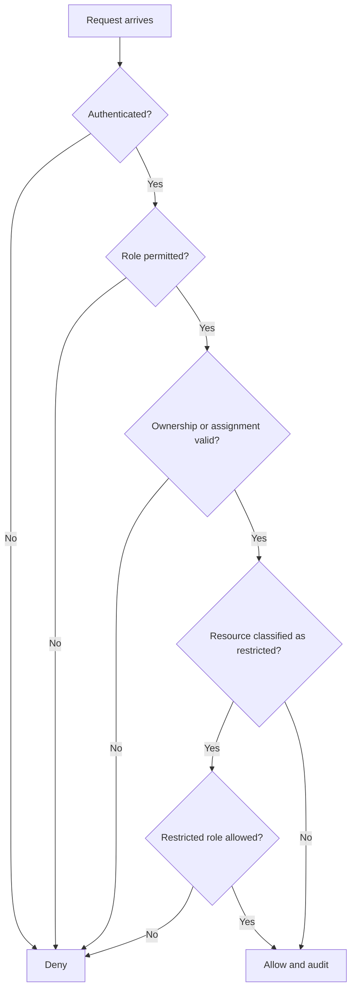
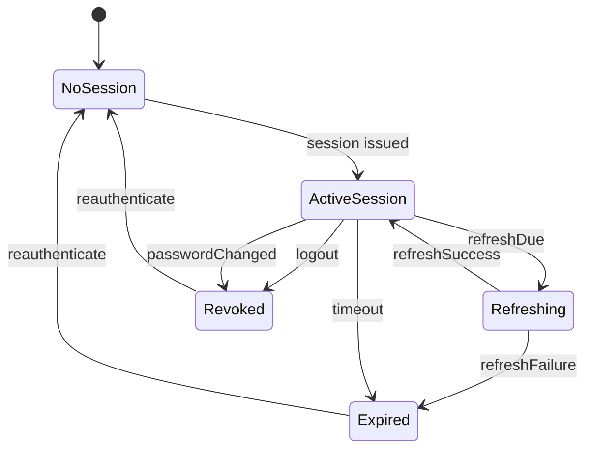
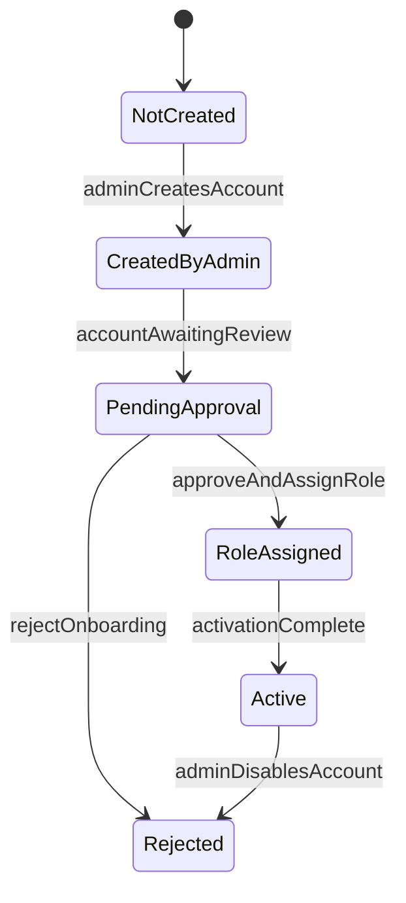
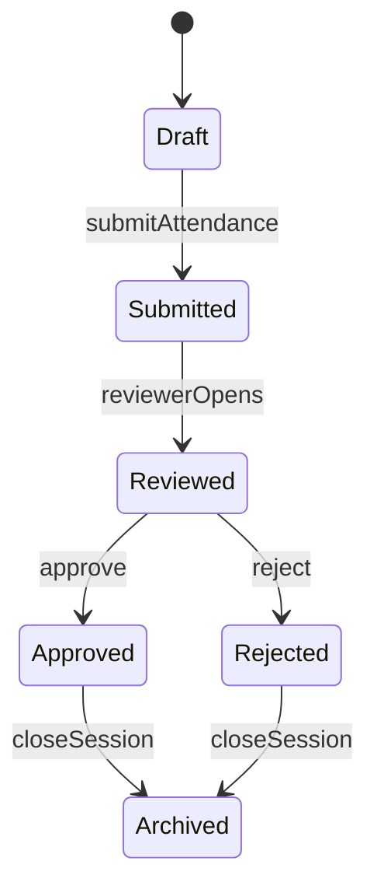
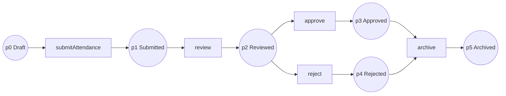
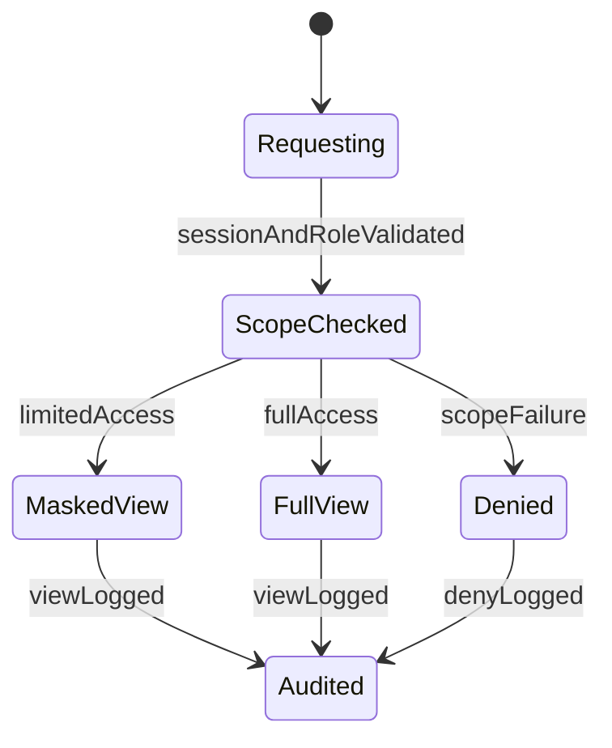
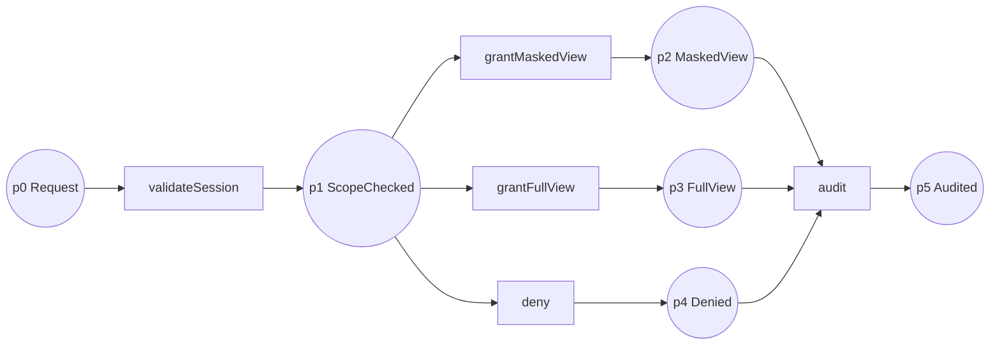
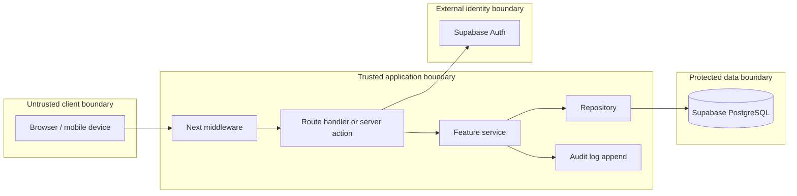
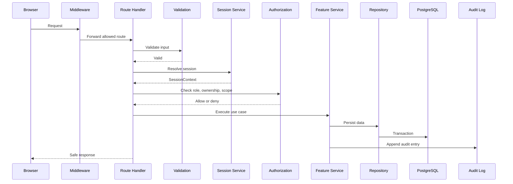

# Formal Specification

Purpose: define the critical behavioural model for the Secure Dance Academy
Management System in a form that is traceable, reviewable, and aligned with the
approved requirements and security baseline.

Audience: assessors, reviewers, architects, backend engineers, QA engineers, and
future maintainers.

## 1. Scope And Assumptions

The system is modelled as a secure, server-authoritative application in which
the browser is untrusted, protected actions require an authenticated session,
and sensitive data is visible only to approved roles and relationships. This
matches the architecture and security decisions already approved for the
project. [ADR 0003, ADR 0004, ADR 0006, ADR 0007]

The model covers:

- Authentication and sign-out.
- Password recovery and password reset.
- Session validity and expiration.
- Controlled onboarding and role assignment.
- Attendance recording.
- Restricted access to performance, injury, and medical data.
- Administrative auditability.

## 2. Formal Notation

Let:

- `u` be a user.
- `r` be a role.
- `p` be a permission.
- `s` be a session.
- `ctx` be a request context.
- `res` be a resource or record.

Define:

- `authenticated(s)` as session validity.
- `authorized(u, action, res)` as role, ownership, and scope approval.
- `scoped(u, res)` as permitted relationship visibility.
- `audited(action)` as append-only audit recording.
- `restricted(res)` as a protected record class such as medical or child data.

### Core Decision Function

`allow(u, action, res, ctx) = authenticated(ctx.session) ∧ serverValidated(ctx) ∧ authorized(u, action, res) ∧ notRateLimited(ctx)`

This is the formal boundary for every protected route and server action.

## 3. Security Properties

| ID | Property | Statement | Requirements / ADRs | Verification basis |
| --- | --- | --- | --- | --- |
| SP-01 | Authentication | No protected action executes without a valid authenticated session. | FR-01, SR-01, ADR 0003 | Session and auth service tests, route guards. |
| SP-02 | Authorization | Role, ownership, and assignment checks are required before access. | FR-03, FR-04, FR-05, SR-02, SR-09, ADR 0006 | Authorization helper and user-service tests. |
| SP-03 | Session safety | Sessions expire or are revoked after logout or password change. | FR-01, FR-02, SR-03, SR-04 | Session-service and auth-service tests. |
| SP-04 | Controlled onboarding | New accounts exist only through authorized onboarding. | FR-22, BRULE-11, SR-13 | Requirements traceability and role-management review. |
| SP-05 | Duplicate prevention | Attendance cannot be duplicated for the same artist and session. | FR-09, BRULE-03, BRULE-07 | Attendance model and repository constraints. |
| SP-06 | Sensitive-data restriction | Child, performance, injury, and medical data are scoped to allowed roles. | FR-10, FR-11, FR-12, BRULE-01, BRULE-02, BRULE-04, SR-09 | Security review and scoped service tests. |
| SP-07 | Auditability | Security-sensitive actions create immutable audit evidence. | FR-17, BRULE-05, SR-07, ADR 0006 | Audit service tests and audit review. |
| SP-08 | Safe failure | Invalid requests fail without leaking stack traces, SQL, or secrets. | SR-05, SR-06, SR-08, SR-10 | API and route-handler tests. |

## 4. Authentication Model

The authentication model covers sign in, sign out, recovery, and reset
behaviour. It is intentionally small: it tracks business states, not framework
internals.

### States

`Anonymous`, `Authenticating`, `Authenticated`, `PendingApproval`,
`Throttled`, `Expired`, `Revoked`

### Events

`submitCredentials`, `authSuccess`, `authFailure`, `resetRequested`,
`logout`, `sessionExpired`, `passwordChanged`, `rateLimitExceeded`

### State Diagram

### Transition Table

| Current state | Event | Guard | Next state | Output |
| --- | --- | --- | --- | --- |
| Anonymous | submitCredentials | Valid payload and rate limit available | Authenticating | Credentials are processed server-side. |
| Authenticating | authSuccess | User account is active and permitted | Authenticated | Session becomes active. |
| Authenticating | authFailure | Credentials invalid | Anonymous | Generic failure without account disclosure. |
| Authenticating | rateLimitExceeded | Too many attempts | Throttled | Retry-after response. |
| Authenticating | active account missing | Account inactive or not approved | PendingApproval | User is signed out safely. |
| Authenticated | logout | Current session valid | Revoked | Session terminates and audit entry is written. |
| Authenticated | sessionExpired | Lifetime reached | Expired | Session is rejected on next request. |
| Authenticated | passwordChanged | Credential updated | Revoked | Old sessions are invalidated. |

### Preconditions And Postconditions

| Workflow | Preconditions | Postconditions |
| --- | --- | --- |
| Sign in | Credential payload is syntactically valid; account is eligible; request is not rate-limited. | Active session or safe denial; audit event recorded for success or failure. |
| Sign out | A session exists or a logged-out request is received. | Current session is terminated or confirmed absent; audit event recorded. |
| Password recovery request | Email input is valid; request meets throttling rules. | Generic success response; reset path issued only if account exists; audit event recorded. |
| Password reset completion | A valid recovery path exists; password satisfies policy. | Credential updated; previous session paths revoked; audit event recorded. |

## 5. Authorization Model

Authorization is a pure server-side decision. The frontend may hide unavailable
actions, but it never decides access.

### Decision Flow

### Role Model

| Role | Allowed scope |
| --- | --- |
| Administrator | Full operational access, subject to explicit security checks and audit logging. |
| Coach | Only assigned artists and permitted operational records. |
| Parent | Only linked child artists and permitted summary views. |
| Artist | Own profile and permitted self-service views only. |

### Authorization Invariants

- `authenticated(ctx) -> required`
- `admin(action) -> explicit approval + audit`
- `parentAccess(res) -> linked(parent, child)`
- `coachAccess(res) -> assigned(coach, artist)`
- `artistAccess(res) -> owner(artist, res)`
- `restricted(res) -> role in {administrator, explicitly permitted coach}`

## 6. Session Lifecycle Model

The session lifecycle is modelled separately from the sign-in decision because
session expiry, refresh, and invalidation must remain explicit.

### States

`NoSession`, `ActiveSession`, `Refreshing`, `Expired`, `Revoked`

### State Diagram

### Session Invariants

- A request without `ActiveSession` cannot reach protected state-changing logic.
- A revoked session cannot become active again without fresh authentication.
- A password change invalidates prior session paths.
- Session expiry leads to safe denial, not partial execution.

## 7. Controlled Onboarding And Role Assignment

Controlled onboarding is modelled because public self-registration is disabled.
[FR-22, BRULE-11]

### States

`NotCreated`, `CreatedByAdmin`, `PendingApproval`, `RoleAssigned`, `Active`, `Rejected`

### State Diagram

### Guards

- The actor must be an authorized administrator.
- The selected role must satisfy approved role policy.
- The account remains inactive until assignment and approval are complete.

## 8. Attendance Recording And Approval

Attendance is modelled as a constrained lifecycle because it affects
operational records and reporting accuracy. [FR-09, BRULE-03, BRULE-07]

### States

`Draft`, `Submitted`, `Reviewed`, `Approved`, `Rejected`, `Archived`

### State Diagram

### Petri Net

### Attendance Invariants

- `unique(session_id, artist_id)` is mandatory.
- An artist record must exist before attendance is created.
- Attendance may be reviewed, approved, or rejected only once per record.

## 9. Protected Record Access

Performance, injury, and medical information share the same access-control
shape. The record may exist, but visibility depends on role, ownership, and
purpose. [FR-10, FR-11, FR-12, SR-09, BRULE-01, BRULE-02, BRULE-04]

### States

`Requesting`, `ScopeChecked`, `MaskedView`, `FullView`, `Denied`, `Audited`

### State Diagram

### Petri Net

### Access Rules

- Parents can only see child records linked to their account. [BRULE-01]
- Coaches can only see assigned artists. [BRULE-02]
- Medical details are visible only to restricted roles. [BRULE-04]
- Search, filtering, and export must not leak data outside the allowed scope.
  [BRULE-10, FR-18, FR-21]

## 10. Invariants

| ID | Invariant |
| --- | --- |
| INV-01 | Every protected request is authenticated before business logic executes. |
| INV-02 | Every protected request is authorized against role, ownership, and scope. |
| INV-03 | Session validity is checked before state-changing actions. |
| INV-04 | Duplicate attendance is impossible for the same artist and session. |
| INV-05 | Child, performance, injury, and medical records are only visible to permitted roles. |
| INV-06 | Audit records are append-only and cannot be edited through normal application paths. |
| INV-07 | Controlled onboarding requires authorized administrator action. |
| INV-08 | Error responses do not leak secrets, SQL, or implementation details. |

## 11. Threat Mitigation Mapping

| Threat | Formal property | Mitigation | Requirement / ADR | Evidence |
| --- | --- | --- | --- | --- |
| Broken access control | INV-01, INV-02, SP-02 | RBAC, ownership checks, restricted repository queries. | FR-03, FR-04, FR-05, SR-02, SR-09, ADR 0006 | Authorization tests and security review. |
| Session hijack or reuse | INV-03, SP-03 | Secure cookies, expiry, logout, password-change invalidation. | FR-01, FR-02, SR-03, SR-10, ADR 0003 | Session-service tests and security review. |
| Brute force / abuse | SP-01, SP-03 | Rate limiting and generic recovery responses. | SR-01, SR-04 | Auth-service and rate-limit tests. |
| Duplicate attendance | INV-04 | Unique business key and rejection path. | FR-09, BRULE-03, BRULE-07 | Repository and integration rules. |
| Sensitive-data leakage | INV-05 | Restricted scopes and safe projections. | FR-10, FR-11, FR-12, SR-09, BRULE-01, BRULE-02, BRULE-04 | Security review and scoped tests. |
| Audit tampering | INV-06 | Append-only audit records and admin-only read access. | FR-17, BRULE-05, SR-07 | Audit service tests and review. |
| Onboarding abuse | INV-07 | Admin approval and disabled public self-registration. | FR-22, BRULE-11, SR-13 | Requirements traceability and role rules. |
| Information disclosure | INV-08 | Safe error envelopes and no internals in responses. | SR-05, SR-06, SR-08 | Route-handler tests and API plan. |

## 12. Trust Boundary Verification

Boundary rules:

1. The browser is untrusted.
2. Middleware and route handlers must validate and authorize every protected
   request.
3. The repository is the persistence boundary, not a place for business rules.
4. Authentication is delegated to Supabase Auth, but session validity is still
   checked server-side.
5. Sensitive data becomes visible only after authorization and scope checks.

## 13. Data Flow Verification

The data flow is safe only when the request passes through validation,
authentication, authorization, business rules, persistence, and audit logging
in that order. This is aligned with the backend and security architecture.
[ADR 0004, ADR 0006]

## 14. Summary

The model shows that the approved system can support its critical workflows
without violating security or integrity constraints. The key business rules are
enforced by state transitions, guards, and scope checks rather than by
frontend-only assumptions.

