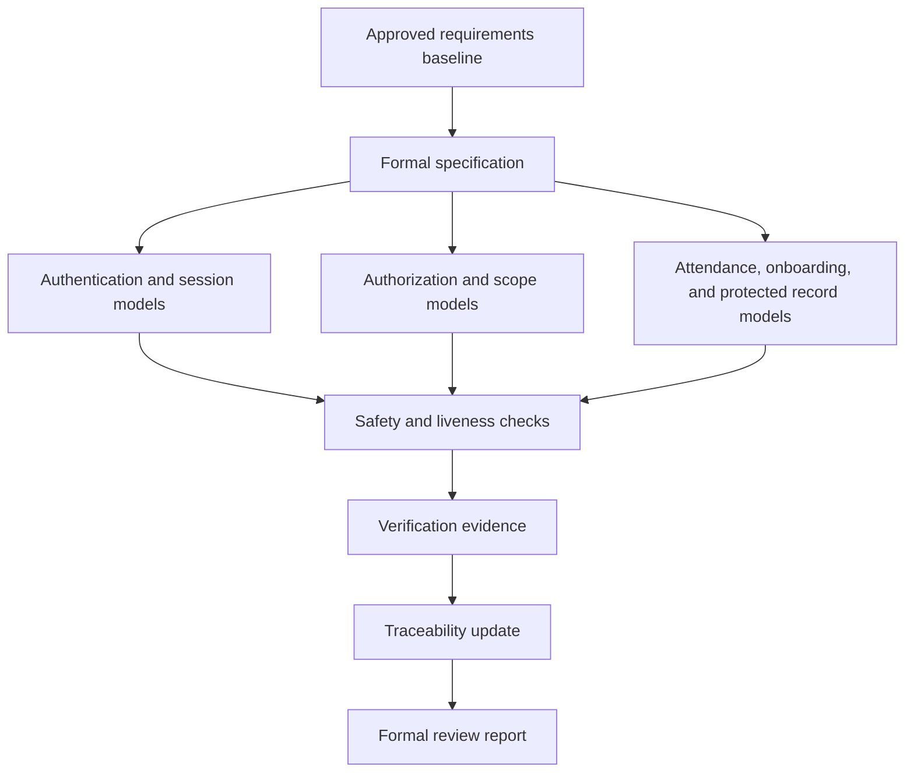

# Formal Methods

Status: Task 10 delivered and verified

This package captures the formal behavioural models for the Secure Dance
Academy Management System. It is aligned with the approved requirements
baseline, the architecture, the security review, and the testing evidence. The
models focus on the highest-risk workflows: authentication, password reset,
session lifecycle, controlled onboarding, role assignment, attendance, and
restricted record access. [FR-01, FR-02, FR-03, FR-04, FR-05, FR-09, FR-10,
FR-11, FR-12, FR-15, FR-16, FR-17, FR-20, FR-22, SR-01, SR-02, SR-03, SR-04,
SR-07, SR-09, SR-10, SR-13, ADR 0003, ADR 0004, ADR 0006]

## Package Contents

| Document | Purpose |
| --- | --- |
| `FORMAL_SPECIFICATION.md` | Formal specification, models, invariants, and threat-mitigation mapping. |
| `VERIFICATION_EVIDENCE.md` | Evidence used to validate the models against requirements and implementation. |
| `TRACEABILITY.md` | Requirement, ADR, API, database, and test traceability updates. |
| `VERIFICATION_REPORT.md` | Formal review summary, reachability conclusions, and residual limitations. |

## Model Overview

## Scope

The package models these business behaviours:

- Sign in, sign out, password recovery, and password reset. [FR-01, FR-02,
  SR-01, SR-03, SR-04, SR-13]
- Role and ownership enforcement for every protected action. [FR-03, FR-04,
  FR-05, SR-02, SR-09]
- Session validity, renewal, and expiration. [SR-03, SR-04, SR-10]
- Controlled onboarding and administrator approval. [FR-22, BRULE-06, BRULE-11]
- Attendance capture and duplicate-prevention rules. [FR-09, BRULE-03,
  BRULE-07]
- Restricted access to performance, injury, and medical information. [FR-10,
  FR-11, FR-12, BRULE-01, BRULE-02, BRULE-04]
- Auditability and safe administrative actions. [FR-17, FR-20, BRULE-05,
  BRULE-09]

## Summary

The formal models are written to support later proof work, release review, and
assessment evidence. They avoid implementation details and instead describe the
business states, allowed transitions, and safety constraints that the approved
system must satisfy.

