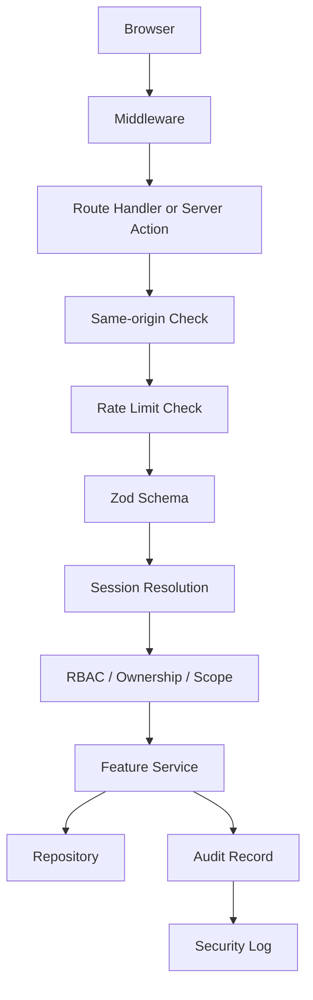

# Security Documentation

Status: Task 08 complete

This folder records the implemented security controls, the threat model, and
the residual risks that remain after hardening the current production boundary.

## Core Controls

- Supabase sessions are stored in secure HTTP-only cookies with SameSite=Lax.
- Authentication is protected with route-layer and service-layer rate limits.
- Authorization is RBAC plus ownership plus assignment scope plus account-state checks.
- Mutating routes enforce same-origin requests before business logic runs.
- Route handlers and server actions are the security boundary, not the client.
- Security headers are applied globally, including CSP, HSTS, frame denial, and referrer policy.
- Console logging redacts sensitive payload fields before output.
- Audit logging captures actor, request, entity, outcome, and metadata details.
- Environment values are validated at startup and secrets are never hardcoded.

## Approved References

- ADR 0003: Supabase Auth and Secure Cookie Sessions.
- ADR 0004: Prisma Repository Data Layer.
- ADR 0006: Security Middleware, Validation, and Audit.

## Document Set

- `README.md` - security control summary and entry point.
- `SECURITY_REVIEW.md` - implemented control review and compliance mapping.
- `THREAT_MODEL.md` - trust boundaries and STRIDE analysis.
- `RESIDUAL_RISK_REGISTER.md` - accepted residual risks and review cadence.

## Backend Security Flow

## Security Notes

- Protected routes never trust the browser session alone.
- Missing or inactive application profiles are rejected at the service layer.
- Sensitive mutations are written through a transaction when the change and its
  audit record should stay aligned.
- Password recovery and sign-in flows use the same secure response envelope and
  no-store responses.
- Residual browser and platform risks are tracked in the residual risk register
  rather than being hidden from the review trail.
