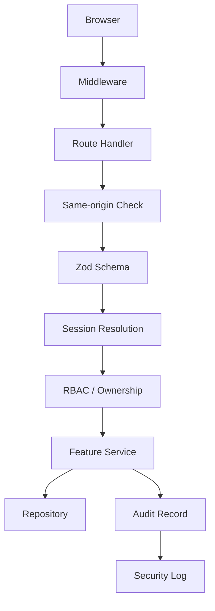

# Security Documentation

This folder records the security controls implemented in the backend foundation.

## Core Controls

- Supabase sessions are stored in secure HTTP-only cookies.
- Authorization is RBAC plus ownership plus account-state checks.
- Mutating routes enforce same-origin requests.
- Route handlers and server actions are the security boundary, not the client.
- Rate limiting is centralized behind a single helper.
- Console logging redacts sensitive payload fields.
- Audit logging captures actor, request, entity, outcome, and metadata details.
- Security headers are applied by middleware to every non-static request.

## Approved References

- ADR 0003: Supabase Auth and Secure Cookie Sessions.
- ADR 0004: Prisma Repository Data Layer.
- ADR 0006: Security Middleware, Validation, and Audit.

## Backend Security Flow

## Security Notes

- Protected routes never trust the browser session alone.
- Missing or inactive application profiles are rejected at the service layer.
- Sensitive mutations are written through a transaction when the change and its
  audit record should stay aligned.
- Password recovery and sign-in flows use the same secure response envelope and
  no-store responses.
