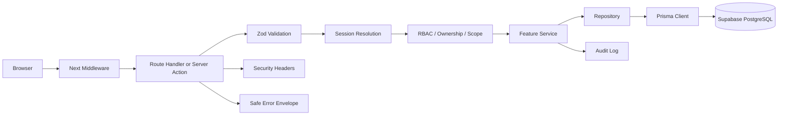

# Security Review

Status: Task 08 complete

This document records the implemented security hardening for the Secure Dance
Academy Management System. It is aligned with SR-01 through SR-13 and ADR 0003,
ADR 0004, and ADR 0006.

## Security Boundary

The browser is never treated as trusted. Authorization is enforced on the
server, and repositories are the persistence boundary.

## Hardening Summary

| Area | Control | Outcome |
| --- | --- | --- |
| Authentication | Service-level and route-level rate limiting for sign-in, reset, and session flows. | Brute-force and abuse attempts are throttled. |
| Authorization | RBAC plus ownership plus assignment scope plus account-state checks. | Sensitive data is only visible to allowed roles. |
| Sessions | Supabase-backed secure cookies with HTTP-only, SameSite=Lax, and secure-only transport in production. | Session theft and fixation risk is reduced. |
| CSRF | Same-origin checks on mutating route handlers. | Cross-site form submissions are rejected. |
| Headers | CSP, HSTS, referrer policy, frame protection, and permissions policy. | Browser attack surface is reduced. |
| Validation | Zod validation on all route and action inputs. | Malformed and over-posted payloads are rejected early. |
| Errors | Standard application errors with no stack traces or SQL leakage. | Internal details do not reach end users. |
| Secrets | Env validation, no hardcoded secrets, no secret logging. | Credential leakage risk is reduced. |
| Audit | Auth, profile, and administrative actions write audit entries. | Sensitive operations remain traceable. |
| Sensitive data | Medical, parent, coach, artist, and admin scope checks on the server. | Child and medical records stay tightly restricted. |

## RBAC Matrix

| Role | Allowed Scope |
| --- | --- |
| Administrator | Full operational access, user management, audit logs, reports, settings, and all protected academy data. |
| Coach | Assigned artists, attendance, performances, injuries, medical summaries, reports, notifications, and own profile. |
| Parent | Linked child artists, attendance, performances, injuries, medical summaries, reports, notifications, and own profile. |
| Artist | Own profile plus permitted attendance, performance, injury, medical-summary, and notification views. |

Role checks are always paired with object scope checks. Administrator access is
controlled, not implicit.

## Auth And Session Design

- Supabase Auth remains the identity provider.
- Session cookies are normalized to HTTP-only, SameSite=Lax, and secure in
  production.
- Sign-in, password reset, and password change flows all rate limit repeated
  attempts.
- Reset-password requests use a generic success message to avoid account
  enumeration.
- Sign-out records an audit event and terminates the current session.

## OWASP Top 10 Mapping

| OWASP Area | Controls |
| --- | --- |
| Broken Access Control | RBAC, ownership checks, assignment scoping, admin-only settings, and server-side route enforcement. |
| Cryptographic Failures | Secure cookies, HTTPS-only deployment boundary, secret handling through environment variables. |
| Injection | Zod validation, sanitization, Prisma parameterization, no raw SQL in the application layer. |
| Insecure Design | Approved architecture, feature boundaries, and server-side authorization gates. |
| Security Misconfiguration | Centralized security headers, HSTS, powered-by disabled, safe defaults. |
| Vulnerable Components | Dependency review and security testing expectations documented in the task baseline. |
| Identification and Authentication Failures | Supabase Auth, password policy, reset flow controls, rate limiting, and session checks. |
| Software and Data Integrity Failures | Audit logging, transactional writes, controlled repositories, and protected update paths. |
| Security Logging and Monitoring Failures | Immutable audit entries, redacted security logs, and safe error handling. |
| SSRF | No server-side outbound fetch surface is exposed in the current implementation; future integrations must preserve this boundary. |

## NIST SSDF Mapping

| SSDF Area | Controls |
| --- | --- |
| Prepare the Organization | Security requirements SR-01 through SR-13, approved architecture, and documented review gates. |
| Protect the Software | Secure cookies, CSP, HSTS, CSRF checks, rate limiting, secrets handling, and strict validation. |
| Produce Well-Secured Software | Repository/service separation, authorization helpers, audit logging, and reviewable error handling. |
| Respond to Vulnerabilities | Security tests, manual review, residual-risk tracking, and documented follow-up items. |

## Attack Surface Analysis

| Surface | Primary Risk | Mitigation |
| --- | --- | --- |
| Public auth pages | Credential attacks and abuse. | Rate limits, server-side validation, generic recovery messages. |
| Protected pages | Unauthorized data access. | Server-side session checks and scope-aware data queries. |
| Route handlers | CSRF, injection, and over-posting. | Same-origin checks, Zod validation, sanitized inputs. |
| Server actions | Cross-site submission and replay. | Same-origin browser execution model, session validation, and server-side rate limits. |
| Cookies and sessions | Hijacking and fixation. | HTTP-only, SameSite, secure defaults, and session termination. |
| Audit data | Repudiation and tampering. | Immutable audit records and transactional writes. |
| Config and secrets | Credential leakage. | Zod env validation and no secret logging. |

## Mitigation Matrix

| Risk | Mitigation | Residual |
| --- | --- | --- |
| Brute-force sign-in | Login rate limiting at the service and route layers. | Low. |
| Password reset abuse | Email-scoped and IP-scoped throttling plus generic responses. | Low. |
| Broken access control | Authorization helpers and scoped repository queries. | Low. |
| Sensitive data exposure | Strict field selection and safe error envelopes. | Low. |
| Browser-based attacks | CSP, HSTS, referrer policy, frame denial, permissions policy. | Low. |

## Security Checklist

- Authentication is protected.
- Authorization is enforced.
- Session handling is hardened.
- CSRF protection is applied where applicable.
- Rate limiting is active for sensitive flows.
- Security headers are set centrally.
- Secrets are handled through environment variables only.
- Input validation is server-side and strict.
- Output is encoded through normal React and JSON response paths.
- Audit logs are created for sensitive operations.
- Medical, parent, coach, artist, and admin scopes are separated.
- Sensitive errors do not expose internals.

## Verification Evidence

- `npm run lint`
- `npm run typecheck`
- `npm run build`
- `npm test -- --runInBand`

## Review Notes

- The current rate limiter is in-memory and process-local. That is acceptable for
  the current deployment profile but should move to a distributed store if the
  app is scaled horizontally.
- The production CSP still allows inline scripts because of the Next.js runtime
  model. The remaining browser attack surface is reduced by the other server-side
  controls and by the HSTS and frame protections.
