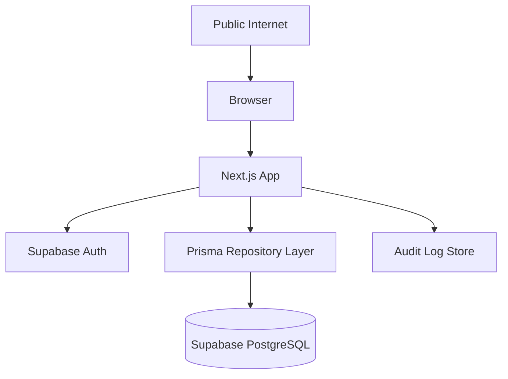

# Threat Model

Status: Task 08 complete

This threat model covers the current production frontend and backend boundary.
It focuses on the flows that handle authentication, protected data, and audit
records.

## Trust Boundaries

The trust boundary is crossed whenever the browser submits a request. The server
must re-check identity, role, scope, and request validity on every sensitive
operation.

## Assets

- User identities and roles.
- Child artist relationships.
- Medical profiles, allergies, conditions, and medications.
- Attendance, performance, injury, and report records.
- Audit logs and security events.
- Session cookies and reset flows.
- Environment secrets and deployment credentials.

## STRIDE Analysis

| Surface | Spoofing | Tampering | Repudiation | Information Disclosure | Denial of Service | Elevation of Privilege | Mitigation |
| --- | --- | --- | --- | --- | --- | --- | --- |
| Sign-in and recovery flows | Stolen credentials. | Payload manipulation. | Weak login traceability. | Account enumeration. | Brute-force attempts. | Session takeover. | Supabase auth, rate limiting, generic responses, audit logs. |
| Protected route handlers | Forged session cookies. | Request body tampering. | Missing audit trail. | Oversharing fields. | Request floods. | Unauthorized role bypass. | Secure cookies, Zod validation, RBAC, no-store responses. |
| Parent and coach scopes | Impersonating a guardian or coach. | Relationship tampering. | Disputed access. | Child record leakage. | Large query abuse. | Cross-scope browsing. | Assignment scoping and server-side ownership checks. |
| Medical records | Fake identity claims. | Unauthorized updates. | Missing change history. | Sensitive data exposure. | High-volume read abuse. | Broader-than-allowed medical access. | Restricted query paths and audit logging. |
| Audit log access | Spoofed admin requests. | Audit tampering. | Loss of accountability. | Sensitive metadata exposure. | Query abuse. | Audit privilege misuse. | Admin-only access, immutable log writes, safe projections. |
| Secrets and config | Fake deployment values. | Config tampering. | None. | Secret leakage. | Misconfigured environments. | Privilege escalation through config. | Env validation, no secret logging, least-privilege runtime. |

## Threat Actors

- External attackers probing public auth surfaces.
- Authenticated users trying to exceed their authorized scope.
- Compromised browsers or scripts attempting cross-site submission.
- Compromised infrastructure or leaked credentials.
- Curious users attempting to infer data outside their role.

## Attack Scenarios

1. A parent tries to access a child record not linked to their account.
2. A coach tries to view an unassigned artist's medical summary.
3. An attacker replays a form submission from another origin.
4. A bot rotates through email addresses on the sign-in form.
5. A user attempts to archive or edit another account without admin scope.
6. A malicious payload attempts to leak stack traces or internal queries.

## Residual Threats

- Distributed brute-force attacks can still occur across many IPs.
- The current rate limiter is process-local rather than shared.
- External identity-provider availability remains a dependency.
- Inline scripts are still required by the current Next.js runtime model.

These residual threats are accepted for the current phase and tracked in the
residual risk register.
