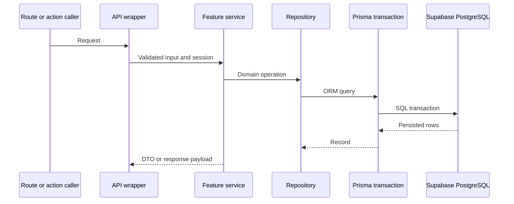

# Integration Test Plan

This plan covers cross-module behaviour where a unit test would miss the actual
boundary between the service, repository, and transaction layers.

## Integration Boundaries

## Planned Scenarios

| Scenario | What it validates | Expected result |
| --- | --- | --- |
| Auth session resolution | Supabase identity is mapped to an application user when a local record exists. | Authenticated session with correct roles and permissions. |
| Sign-in success | Session update, last-login update, and audit recording happen together. | Updated session and a success audit trail. |
| Sign-in denial | Inactive or missing application profiles are rejected. | Sign-out and `ACCOUNT_NOT_ACTIVE`. |
| User profile update | Repository update and audit write occur in one transaction. | Persisted update and immutable audit row. |
| User archive | Archive status and audit snapshot are written together. | Archived user and consistent audit record. |
| Audit listing | Permission checks and pagination are respected. | Admin-only access with stable page info. |
| Dashboard selection | Role-based dashboards resolve the correct repository path. | Role-specific dashboard model. |

## Test Data

- Seeded roles and baseline settings from `prisma/seed.ts`.
- Dedicated sandbox accounts for administrator, coach, parent, and artist roles.
- Controlled records for active, pending, suspended, and archived account states.
- Minimal activity, attendance, and audit records for list and transaction checks.

## Exit Criteria

- Repository methods are exercised through service calls, not direct table access.
- Transactional writes leave no partial update behind.
- Permission failures stop the workflow before data changes occur.
- Audit entries and business rows remain consistent when a change succeeds.
