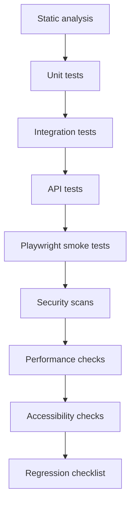

# Master Test Plan

This plan defines the QA strategy for the Secure Dance Academy Management System.
It is aligned with the approved requirements baseline, the backend and frontend
implementations, and ADR 0003, ADR 0004, ADR 0006, and ADR 0007.

## Scope

The test program covers:

- Authentication and session management. [SR-01, SR-03, SR-04]
- Authorization and RBAC. [SR-02]
- Input validation and error handling. [SR-05, SR-06]
- Audit logging and accountability. [SR-07]
- Secret handling and transport hardening. [SR-08, SR-10]
- Sensitive child, medical, and role-specific access control. [SR-09]
- Security verification and standards mapping. [SR-11, SR-12]
- Password policy enforcement. [SR-13]
- Core UX flows for the implemented dashboard, profile, and auth screens. [NFR-06]
- Core performance expectations for common pages and record views. [NFR-01]

## Testing Pyramid

## Quality Gates

Release readiness requires:

1. Lint, type checking, build, and Jest pass.
2. Security tests confirm auth, authz, CSRF, headers, rate limits, and safe errors.
3. Core routes and services behave as documented.
4. Performance and accessibility checks meet their thresholds.
5. No unresolved critical or high-severity defects remain.
6. Test evidence is written down and linked to the relevant artefacts.

## Test Layers

| Layer | Purpose | Primary evidence |
| --- | --- | --- |
| Unit | Validate pure logic, security helpers, and service branching. | Jest output and coverage summary. |
| Integration | Validate repository/service collaboration and transactions. | Integration plan and future DB-backed runs. |
| API | Validate route contracts, status codes, headers, and auth states. | API plan and route-wrapper tests. |
| Browser | Validate navigation, forms, redirects, and responsive behaviour. | Playwright plan and future browser runs. |
| Security | Validate OWASP-aligned controls and abuse cases. | Security testing report, ZAP prep, and unit coverage. |
| Performance | Validate load, search, pagination, and build budgets. | Performance checklist and measured timings. |
| Accessibility | Validate keyboard, screen reader, and contrast behaviour. | Accessibility checklist and manual review. |
| Regression | Re-run the high-risk workflows after every major change. | Regression checklist and release evidence. |

## Execution Order

1. Static analysis.
2. Unit tests.
3. Integration tests.
4. API tests.
5. Browser smoke tests.
6. Security scans.
7. Accessibility review.
8. Performance review.
9. Regression review.
10. Final release decision.

## Exit Criteria

The project can move beyond QA when:

- Core authentication and authorization flows are verified.
- Sensitive data access paths are covered by tests.
- User-facing error states remain safe and consistent.
- Performance and accessibility checks are acceptable.
- Residual risks are documented and consciously accepted.
- The final QA report records the evidence and remaining limitations.
