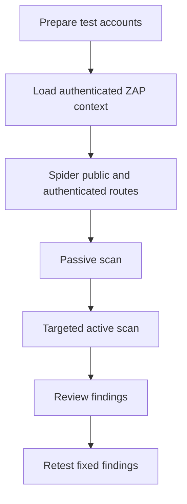

# OWASP ZAP Preparation Notes

This document prepares the Secure Dance Academy Management System for an
authenticated OWASP ZAP run against the approved application boundary.

## Scope

The scan should cover:

- Public authentication pages and public health endpoint. [SR-01, SR-13]
- Logged-in dashboard, profile, users, audit, and settings routes. [SR-02, SR-07]
- Read and write APIs that accept user input. [SR-05, SR-06]
- Protected child, medical, and role-scoped data paths. [SR-09]
- Session, cookie, and header behaviour. [SR-03, SR-04, SR-10]

Out of scope:

- Third-party services that are not part of the repository.
- Supabase infrastructure itself.
- Browser-only visual regressions that are better handled by Playwright.

## Scan Model

## Required Test Accounts

- Administrator account for full-scope authenticated crawling.
- Coach account for scoped access checks.
- Parent account linked to at least one child record.
- Artist account for self-service checks.

Use dedicated sandbox accounts only. Never point ZAP at real production data.

## Authentication Context

Configure ZAP with the same session model used by the application:

- Supabase-based sign-in.
- Secure cookies.
- CSRF protection on state-changing requests.
- Explicit role selection in the authenticated session.

Capture only the minimum cookies needed for the test context. Do not export
production credentials into the scan workspace.

## Expected Findings

The first run may surface:

- Missing security headers on intentionally public routes.
- Reflected input that is already neutralized by server-side encoding.
- Cached responses that should remain `no-store` for sensitive pages.
- Role-gated pages that confirm access control through 401 or 403 responses.

Treat any unreviewed active-scan result as a defect until manually classified.

## Pass Criteria

- No critical or high-severity unresolved findings remain.
- Authentication and authorization checks behave consistently with the route
  and service tests. [SR-01, SR-02, ADR 0006]
- CSRF, headers, rate limiting, and error handling remain in place. [SR-03,
  SR-04, SR-05, SR-06, SR-10]
- Sensitive child and medical data paths do not leak through alternate routes.
  [SR-09]

## Evidence To Capture

- ZAP context export.
- Authenticated scan configuration.
- Passive and active scan reports.
- Manual triage notes for each finding.
- Retest evidence after any fix.

