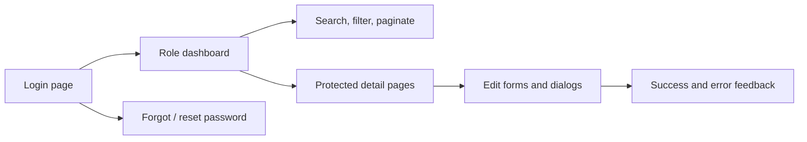

# Playwright Test Plan

The browser suite should cover the user journeys that matter most in the rendered
application shell. It is the correct tool for redirects, form behaviour, mobile
navigation, and accessible interaction patterns.

## Planned Journeys

## Smoke Coverage

| Journey | Checks |
| --- | --- |
| Login page | Title, fields, helper text, reset link, and basic validation. |
| Protected redirect | Unauthenticated access to a protected route redirects to `/login`. |
| Session-expired state | Session expiry guidance is visible and actionable. |
| Forbidden page | The 403 page explains the access issue and offers a recovery path. |
| Dashboard shell | Sidebar, header, and role-specific sections render correctly. |
| Forms | Disabled submit state, validation messaging, and recovery text. |
| Tables | Search, pagination, empty state, and row actions render on the page. |
| Mobile layout | Sidebar and primary controls remain usable at narrow widths. |

## Accessibility Checks

- Keyboard-only navigation reaches all interactive elements.
- Focus order follows the visual order.
- Dialogs trap focus and restore it on close.
- Inputs have labels and error messaging.
- Colour is not the only signal for state.

## Execution Notes

- Keep the suite small and high value.
- Use seeded accounts where authenticated state is required.
- Capture screenshots and traces for failed cases.
- Prefer deterministic selectors and avoid brittle text matches where a role or
  label selector is available.
