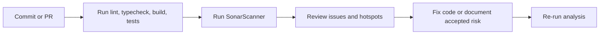

# SonarQube Preparation Notes

These notes define how to run SonarQube against the current codebase without
guesswork.

## Analysis Scope

Include the production source and supporting test code:

- `app/**/*.ts`
- `config/**/*.ts`
- `features/**/*.ts`
- `lib/**/*.ts`
- `middleware.ts`
- `tests/**/*.ts`

Exclude generated or vendor content:

- `node_modules/`
- `.next/`
- `coverage/`
- `dist/`
- build artefacts in temporary directories

## Project Setup

- Project name: `Secure Dance Academy Management System`
- Project key: `secure-dance-academy`
- Default branch: `main`

Use the same repository naming convention across SonarQube, CI, and release
notes so quality reports remain easy to trace.

## Quality Expectations

- No new critical or high-severity issues.
- No new security hotspots left unreviewed.
- Coverage on changed code should be treated as a release gate.
- Test files should be analysed for maintainability, but not counted as product
  logic debt.

## Analysis Flow

## Preparation Steps

1. Run the full local validation suite first.
2. Confirm the branch contains the expected Task 09 documents and test files.
3. Point SonarQube at the repository root with the source exclusions above.
4. Review new code issues before merging.
5. Record the SonarQube dashboard URL in the release evidence bundle.

## Interpretation Notes

- Treat security hotspots as mandatory human review items.
- Keep duplicate-code findings focused on the production source tree.
- Use rule violations to drive cleanup only when they map to approved
  requirements or ADRs. [SR-05, SR-06, ADR 0006]

