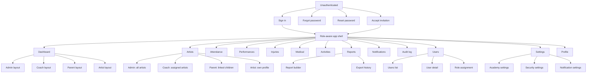
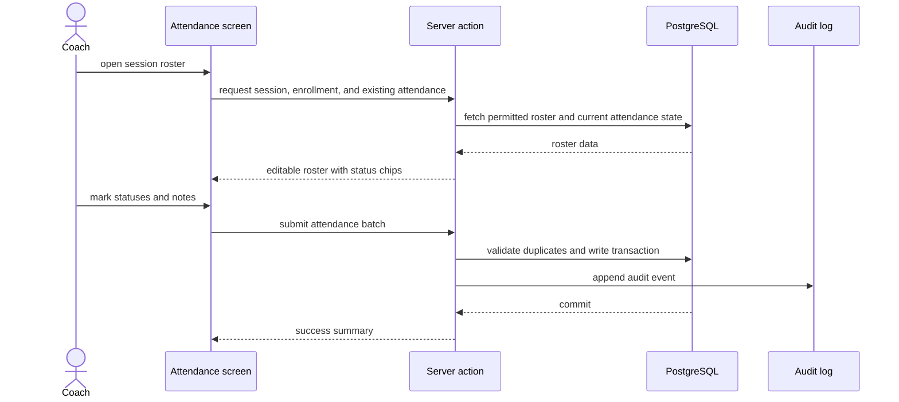
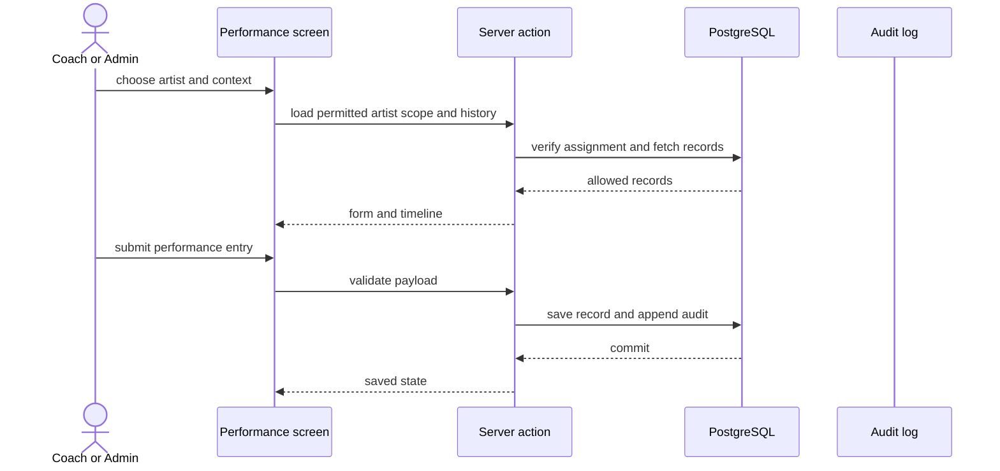
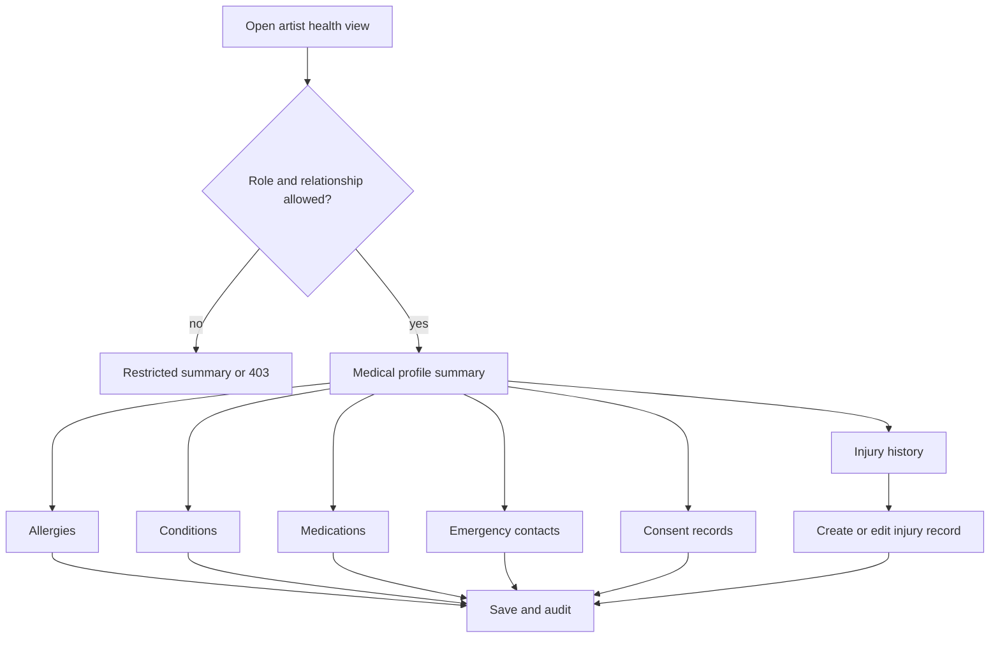
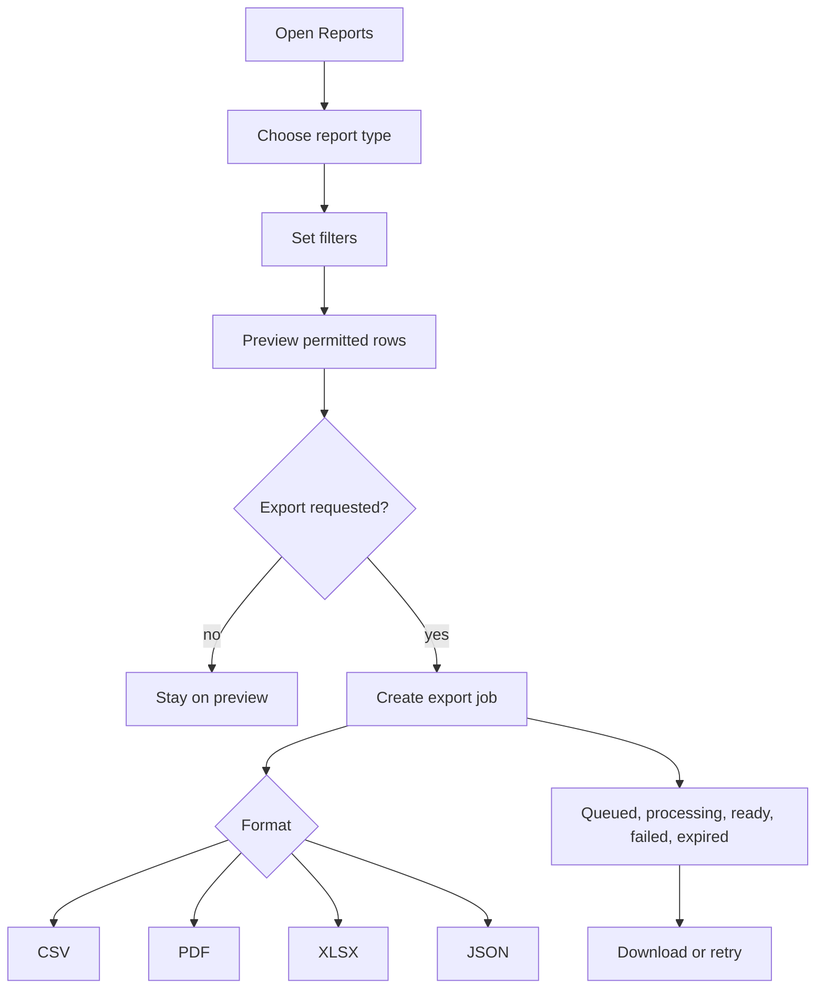
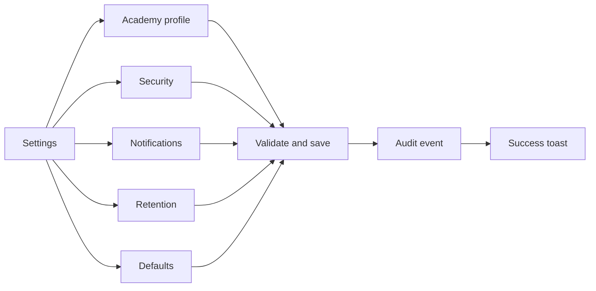

# UI / UX Blueprint

## Purpose

This document defines the approved user experience for the Secure Dance Academy
Management System. It is the handoff baseline for frontend implementation and
must be read alongside the approved requirements, architecture, database design,
and architecture decisions.

## Scope And Guardrails

- In scope: authenticated app shell, role-based dashboards, auth screens, admin
  screens, coach screens, parent screens, artist screens, workflows, design
  system, states, accessibility, responsive behavior, security UX, and developer
  handoff notes.
- Out of scope: public marketing pages, public self-registration, payments,
  multi-academy tenancy, native mobile apps, AI assistants, and other items
  already marked out of scope in the requirements baseline.
- The UI is light-first and enterprise-oriented. Dark mode remains an open
  project decision and is not part of this blueprint.
- The frontend must follow the approved Server Components first strategy and
  must not move security or business rules into the browser.

## Approved Reference Baseline

| Design area | Approved requirements | Approved ADRs |
| --- | --- | --- |
| Authentication and onboarding | FR-01, FR-02, FR-22, SR-01, SR-03, SR-04 | ADR 0003, ADR 0006 |
| Authorization and role-aware navigation | FR-03, FR-15, FR-19, BRULE-01, BRULE-02, BRULE-06, BRULE-09, BRULE-10 | ADR 0005, ADR 0006 |
| Controlled record workflows | FR-09, FR-10, FR-11, FR-12, FR-13, BRULE-03, BRULE-04, BRULE-07, BRULE-08 | ADR 0005, ADR 0006 |
| Reporting and exports | FR-16, FR-18, FR-21, BRULE-10, PR-01, PR-05, PR-08 | ADR 0006 |
| Accessibility and usability | NFR-06, NFR-07, NFR-08, NFR-12 | ADR 0005, ADR 0006 |
| Security UX and auditability | SR-02, SR-06, SR-07, SR-09, SR-10, SR-13 | ADR 0003, ADR 0006 |

## Design Decision Traceability

| UI decision | Why it exists | Traceability |
| --- | --- | --- |
| Generic auth errors and no account enumeration | Reduces takeover risk and avoids leaking account state. | FR-01, FR-02, FR-22, SR-01, SR-03, SR-04, SR-06, ADR 0003, ADR 0006 |
| Role-aware shell with filtered navigation | Keeps users focused on permitted work without exposing unrelated areas. | FR-03, FR-15, BRULE-01, BRULE-02, BRULE-09, BRULE-10, ADR 0005, ADR 0006 |
| Dense but readable dashboards | Supports operational speed without turning the UI into a training exercise. | NFR-01, NFR-06, NFR-07, ADR 0005 |
| Shared table and filter pattern | Standardizes search, sort, filter, pagination, and export across list views. | FR-18, FR-21, NFR-05, NFR-07, ADR 0005 |
| Masked medical and injury surfaces | Protects sensitive data while still allowing permitted work. | FR-11, FR-12, PR-02, PR-03, SR-09, BRULE-04, ADR 0006 |
| Tablet-first attendance workspace | Matches the high-frequency check-in workflow used by coaches. | FR-09, BRULE-03, NFR-01, NFR-07, ADR 0005 |
| Export preview before download | Lets users confirm what leaves the system. | FR-16, FR-21, BRULE-10, PR-01, PR-05, PR-08, ADR 0006 |
| Immutable audit views | Supports accountability without allowing audit tampering. | FR-17, SR-07, BRULE-05, ADR 0006 |
| Accessible enterprise controls | Ensures the interface works for keyboard, screen reader, and low-vision users. | NFR-06, NFR-08, NFR-12, SR-06, ADR 0005, ADR 0006 |
| Server-validated interactions | Keeps the browser as a convenience layer, not the source of truth. | FR-03, SR-02, SR-05, ADR 0005, ADR 0006 |

## Personas

| Persona | Goals | Frustrations | UX implications |
| --- | --- | --- | --- |
| Administrator | Manage users, roles, records, reports, and settings with confidence. | Too many manual checks, unclear audit history, and slow record lookup. | Dense tables, strong search, clear audit trails, and keyboard-friendly actions. |
| Coach | Record attendance, track progress, and flag safeguarding issues quickly. | Repeated data entry, slow roster navigation, and unclear assignment boundaries. | Tablet-friendly layouts, fast roster editing, bulk actions, and assignment-aware scoping. |
| Parent | See linked child information without noise or confusion. | Not knowing where information lives and not understanding record status. | Simple navigation, large readable cards, mobile-first layouts, and clear summaries. |
| Adult Artist | Review personal progress and keep profile data current. | Irrelevant screens and unclear progress feedback. | Focused personal dashboard, clean history views, and self-service profile editing. |
| Child Artist | See only the simplest, safest view of their own information. | Complex interfaces and too many choices. | Minimal navigation, larger targets, plain language, and reduced cognitive load. |

## User Journeys

| Journey | Entry trigger | Key steps | Success signal | Traceability |
| --- | --- | --- | --- | --- |
| Controlled onboarding | An admin creates or approves an account. | Invite created, invite accepted, role attached, account becomes usable. | User lands in the correct role-aware area. | FR-22, FR-01, FR-03, BRULE-11, ADR 0003 |
| Sign in and session start | User opens the login screen. | Submit credentials, bootstrap session, load scope, redirect to dashboard. | User reaches the right dashboard with a valid session. | FR-01, SR-01, SR-03, ADR 0003 |
| Password recovery | User requests access recovery. | Request reset, check inbox, validate token, set new password, reauth. | Old session is invalidated and access is restored safely. | FR-02, SR-03, SR-04, ADR 0003 |
| Daily attendance capture | Coach opens today's session. | Select session, review roster, mark statuses, save batch, confirm totals. | Attendance is stored once and audited. | FR-09, BRULE-03, NFR-01, ADR 0005 |
| Performance review | Coach or admin opens an assigned artist. | Review history, add performance entry, save notes and score. | Record appears in the artist timeline. | FR-10, BRULE-02, BRULE-08, ADR 0006 |
| Injury and medical update | Authorized staff opens a protected health view. | Review sensitive tabs, update permitted fields, save, audit. | Restricted data remains protected and current. | FR-11, FR-12, SR-09, BRULE-04, ADR 0006 |
| Parent review | Parent opens a linked child profile. | Switch child, review attendance and progress, open contact or consent info. | Only linked children and permitted data are visible. | FR-07, FR-15, PR-02, PR-03, BRULE-01 |
| Reporting and export | Admin or permitted user opens Reports. | Choose report type, set filters, preview, export, monitor job status. | A permitted file is generated and tracked. | FR-16, FR-18, FR-21, BRULE-10, ADR 0006 |

## Navigation Map

## Shared Shell Pattern

All authenticated screens use the same shell so the app feels stable and easy to
scan.

| Region | Contents | Notes |
| --- | --- | --- |
| Top bar | Search, notifications, profile menu, session state, role badge | Keep it short and consistent across all pages. |
| Sidebar | Role-aware navigation and quick links | Collapse into a drawer on smaller screens. |
| Page header | Title, description, primary action, secondary actions, breadcrumbs | Every page should have a clear next step. |
| Content area | Tables, forms, cards, timelines, tabs, charts | Avoid nested card stacks and keep density intentional. |
| Secondary rail | Alerts, quick actions, recent activity, scope notes | Use only when it adds decision value. |

## Screen Inventory

| Screen group | Route example | Primary roles | Purpose |
| --- | --- | --- | --- |
| Sign in | `/login` | All unauthenticated users | Start a secure session. |
| Password recovery | `/forgot-password` | All users with recovery access | Request a safe reset path. |
| Password reset | `/reset-password` | Users with a valid recovery token | Set a new password and reauth. |
| Invitation acceptance | `/accept-invite` | Invited users | Complete controlled onboarding. |
| Pending approval | `/pending-approval` | New users awaiting activation | Explain that the account is not active yet. |
| Session expired | `/session-expired` | All authenticated users | Reauthenticate cleanly. |
| Access denied | `/403` | Users without permission | Explain that the requested action is unavailable. |
| Not found | `/404` | All users | Explain that the page or record cannot be found. |
| Server error | `/500` | All users | Show a safe recovery path. |
| Dashboard | `/dashboard` | All authenticated roles | Role-aware landing page. |
| Global search | `/search?q=` | All authenticated roles | Search within the user's permitted scope. |
| Notifications | `/notifications` | All authenticated roles | Review in-app notifications. |
| Profile | `/profile` | All authenticated roles | Update permitted personal data. |
| Artists | `/artists` | Admin, coach, parent, artist | View the scope allowed by the role. |
| Artist detail | `/artists/[id]` | Role-dependent | Review history, tabs, and permissions. |
| Attendance | `/attendance` | Admin, coach | Select session and record attendance. |
| Attendance detail | `/attendance/[activityId]` | Admin, coach | Edit a specific roster or session. |
| Performances | `/performances` | Admin, coach, parent where permitted, artist | Review and add performance records. |
| Performance detail | `/performances/[id]` | Role-dependent | View or edit a single record. |
| Injuries | `/injuries` | Admin, coach | Record and review injury events. |
| Medical | `/medical` | Admin, parent, authorized coach | Review restricted medical information. |
| Activities | `/activities` | Admin, coach, parent, artist | View sessions and schedules. |
| Reports | `/reports` | Admin and permitted roles | Build, preview, and export reports. |
| Export history | `/reports/exports` | Admin and permitted roles | Monitor queued and completed exports. |
| Users | `/users` | Admin only | Manage accounts and roles. |
| User detail | `/users/[id]` | Admin only | Review status, roles, links, and audit history. |
| Invitations | `/users/invitations` | Admin only | Create, resend, or revoke invitations. |
| Audit log | `/audit-log` | Admin only | Review immutable activity history. |
| Settings | `/settings` | Admin only | Configure academy and system settings. |

## Role-Based Dashboard Layouts

| Role | Primary layout | Above the fold | Main work area | Secondary rail | Primary actions |
| --- | --- | --- | --- | --- | --- |
| Administrator | Three-zone dashboard | KPI strip for approvals, exceptions, and export status. | Recent activity, audit events, user tasks, system notices. | Alerts, quick links, report shortcuts. | Create user, review audit, manage settings, open reports. |
| Coach | Two-zone dashboard | Today's schedule and attendance queue. | Assigned artists, performance shortcuts, injury alerts. | Upcoming activities and class notes. | Open roster, record attendance, add performance, report injury. |
| Parent | Stacked summary dashboard | Child selector and the latest attendance summary. | Progress timeline, medical or consent flags, recent notifications. | Contact cards and quick links to child detail. | Open child detail, review reports, update contact info where permitted. |
| Artist | Focused personal dashboard | Next class, attendance status, and personal progress summary. | History cards for performance, attendance, and achievements. | Notifications and profile completion prompts. | Open profile, review schedule, view history. |

## Authentication Screens

| Screen | Purpose | Important elements | Security UX notes |
| --- | --- | --- | --- |
| Sign in | Authenticate a user with controlled access. | Email, password, sign-in button, forgot-password link. | Generic failure message only; never confirm whether an account exists. |
| Forgot password | Request a safe recovery path. | Email field, submit button, neutral confirmation copy. | Rate limited and non-enumerating. |
| Check email | Confirm that a recovery or invite email was sent. | Short instruction text, resend control after delay. | Never reveal if the address is valid beyond what is necessary. |
| Reset password | Set a new password. | New password, confirm password, strength guidance, submit. | Enforce password policy and invalidate the old session path. |
| Accept invitation | Complete controlled onboarding. | Invite code state, account details, password setup, accept button. | Requires a valid invitation and role assignment. |
| Pending approval | Explain that the account is not active yet. | Status message, contact instructions, sign-out action. | Do not expose internal approval details. |
| Session expired | Reauthenticate after timeout. | Session message, sign in button. | Clear the expired session state before retrying. |
| Access denied | Block unauthorized access. | Short explanation, return-to-dashboard link. | Explain the action, not the authorization rule in detail. |

## Admin Screens

| Screen | Purpose | Key UI elements | Notes |
| --- | --- | --- | --- |
| Admin dashboard | Show the system summary and urgent work. | KPIs, pending approvals, audit snippets, export status. | Fast access to oversight tasks. |
| Users list | Manage accounts and roles. | Search, filters, table, row actions, bulk status controls. | Default to scope-safe results only. |
| User detail | Review a single account. | Profile summary, roles, linked artists, audit tab, disable or restore actions. | Use a drawer or tabbed detail page. |
| Invitations | Manage controlled onboarding. | Create invitation, resend, revoke, expiry status, target artist link. | Reflect the invitation lifecycle clearly. |
| Roles and permissions | Review assigned access. | Role matrix, effective access summary, change history. | Focus on readable scope, not implementation rules. |
| Audit log | Review immutable history. | Date filter, actor filter, action filter, entity detail drawer. | Mask sensitive field values in diffs when needed. |
| Reports center | Build and export operational reports. | Report type selector, filters, preview, export format selector. | Show export scope before generation. |
| Settings | Configure academy and system settings. | Scoped tabs, read/write indicators, confirmation on save. | Separate system and academy settings visually. |
| Activities management | Maintain sessions and events. | Calendar, activity list, status badges, detail drawer. | Keep scheduling visible without clutter. |

## Coach Screens

| Screen | Purpose | Key UI elements | Notes |
| --- | --- | --- | --- |
| Coach dashboard | Put the day's work at the top. | Today's classes, attendance queue, assigned artists, alerts. | Optimize for rapid scanning. |
| Assigned artists | Work from the current roster. | Search, filters, roster cards, assignment indicators. | Only show permitted artists. |
| Attendance session | Record attendance for a class. | Roster table, status chips, notes, bulk actions, save bar. | Tablet-first layout for desk use. |
| Performance entry | Add a performance record. | Artist selector, kind selector, score, notes, save action. | Keep the form short and structured. |
| Injury report | Report and track an injury event. | Incident time, body area, severity, status, notes, follow-up. | Mark sensitive information clearly. |
| Activity calendar | Review upcoming sessions and events. | Date navigation, calendar view, list view, filters. | Useful for planning and attendance prep. |
| Artist detail | Review assigned artist history. | Tabs for attendance, performance, injuries, and activity history. | Keep the detail view read-only unless the role allows editing. |

## Parent Screens

| Screen | Purpose | Key UI elements | Notes |
| --- | --- | --- | --- |
| Parent dashboard | Provide a simple overview of linked children. | Child cards, attendance summary, progress summary, notifications. | Mobile-first and low noise. |
| Children overview | Switch between linked children. | Child selector, summary cards, status badges. | Only linked profiles are shown. |
| Child detail | Review permitted child data. | Summary tab, attendance tab, performance tab, medical or consent tab. | Sensitive tabs are visible only to authorized parents. |
| Consent and contacts | Review safeguarding and contact data. | Consent matrix, emergency contacts, status badges. | Do not expose more than the parent is allowed to see. |
| Notifications | Review important updates. | Notification list, unread filter, archived filter. | Content must avoid leaking restricted details. |

## Artist Screens

| Screen | Purpose | Key UI elements | Notes |
| --- | --- | --- | --- |
| Artist dashboard | Give the user a personal work area. | Next session, progress summary, attendance snapshot, notifications. | Keep it simple and self-directed. |
| My profile | Update permitted personal data. | Editable fields, validation, save state, history summary. | Protect sensitive fields and read-only areas. |
| My schedule | Review classes and activities. | Calendar, agenda list, event detail panel. | Works well on mobile and tablet. |
| My performance | Review personal progress. | Timeline, record cards, trend summary. | Use plain language and clear status labels. |
| My attendance | Review attendance history. | Table or card list with status chips. | Read-only for artists. |

## Attendance Workflow

### Attendance Design Notes

- Use a step-based flow: select session, review roster, mark statuses, save.
- Default the screen to the current day and the current coach assignment.
- Show attendance statuses as chips using the approved enum values: Pending,
  Present, Absent, Late, Excused, Voided.
- Surface duplicate prevention before save, not after the user has finished the
  whole roster.
- On desktop, use a data table with fixed actions. On tablet, use a split view
  with the roster on one side and the selected artist detail on the other.
- On mobile, collapse the roster into stacked cards and keep the save action
  sticky.

Traceability: FR-09, FR-18, BRULE-03, BRULE-07, NFR-01, NFR-07, ADR 0005, ADR 0006.

## Performance Workflow

### Performance Design Notes

- Use a short form with an activity link when the record belongs to a session.
- Present performance kinds as segmented choices using the approved enum values:
  Rehearsal, Performance, Assessment, Competition, Showcase, Other.
- Show previous entries in a timeline so users can scan progress quickly.
- Keep comments structured and concise so they are useful in reports.

Traceability: FR-10, FR-18, BRULE-02, BRULE-07, BRULE-08, ADR 0005, ADR 0006.

## Injury And Medical Workflow

### Injury And Medical Design Notes

- Split the experience into two layers: a quick injury report screen and a
  restricted medical profile screen.
- Use clear lock indicators for fields that cannot be edited by the current
  role.
- Show only the minimum necessary medical summary by default.
- Keep the full medical profile on tabbed sections for allergies, conditions,
  medications, emergency contacts, and consent records.
- Use the approved enum values for injury status: Open, Monitoring, Recovered,
  Closed.
- Make the severity control visually distinct: Low, Medium, High, Critical.

Traceability: FR-11, FR-12, PR-02, PR-03, PR-04, SR-09, BRULE-04, ADR 0006.

## Reports Workflow

### Reports Design Notes

- The user should always see the report scope before export.
- Filters should mirror the available approval scope and never leak hidden
  records.
- Export history needs clear status badges using the approved export statuses:
  Queued, Processing, Ready, Failed, Expired.
- Use a preview table so the user can sanity check the result set before
  generating the file.

Traceability: FR-16, FR-18, FR-21, BRULE-10, PR-01, PR-05, PR-08, ADR 0006.

## Settings Workflow

### Settings Design Notes

- Separate system settings from academy settings with explicit scope labels.
- Show read-only state for settings the current role cannot edit.
- Use confirmation for changes that affect passwords, privacy, retention, or
  notification behavior.
- Keep the settings area sparse and predictable rather than tab-heavy.

Traceability: FR-20, BRULE-09, PR-05, ADR 0006.

## Design System

The design system is built for operational work, not marketing pages. It must be
consistent, restrained, and easy to scan.

### Design Principles

- Clarity before decoration.
- Consistency before novelty.
- Accessibility before motion.
- Security before convenience.
- Dense information only where it helps the task.
- Shared components before feature-specific variants.

### Layout Rules

- Use a full-width application shell with a collapsible sidebar on desktop.
- Keep page headers consistent: title, description, primary action, secondary
  actions, and breadcrumbs where depth exists.
- Avoid nested card stacks. Use full-width sections and restrained surfaces.
- Use a 12-column desktop grid, a 6-column tablet grid, and a single-column
  mobile stack.
- Keep cards at 8px radius or less.

### Component Inventory

| Component family | Examples | Purpose |
| --- | --- | --- |
| Shell | AppShell, SidebarNav, TopBar, Breadcrumbs | Stable application frame and navigation. |
| Header | PageHeader, SectionHeader, QuickActionBar | Keep every screen oriented and task-led. |
| Display | StatCard, PersonCard, StatusBadge, Timeline, Avatar | Present summary data and identity cues. |
| Data | DataTable, FilterBar, SearchInput, DetailTabs | Support search, filter, pagination, and detail drill-down. |
| Forms | TextField, TextArea, Select, Combobox, DatePicker, RadioGroup, Checkbox, Toggle, DateRangePicker | Capture structured input with clarity. |
| Feedback | Skeleton, EmptyState, InlineAlert, Toast, ConfirmDialog, PermissionBanner, SensitiveFieldMask | Explain loading, errors, safety, and state. |
| Navigation | Drawer, Tabs, SegmentedControl, DropdownMenu | Move between views without losing context. |

### Typography System

| Token | Value | Use |
| --- | --- | --- |
| Font family | Inter, system-ui, sans-serif | Primary UI text. |
| Font family mono | ui-monospace, SFMono-Regular, Menlo, monospace | IDs, audit metadata, and technical values. |
| Page title | 24px / 32px, 600 | Screen headings. |
| Section title | 18px / 24px, 600 | Card and panel headers. |
| Body | 14px / 20px, 400 | Default reading size. |
| Body strong | 14px / 20px, 500 | Emphasis inside content. |
| Small text | 12px / 16px, 400 | Helper text and metadata. |
| Tabular number | Enabled | Counts, dates, and financial-like totals if present. |

Rules:

- Do not scale fonts with viewport width.
- Use explicit size tokens only.
- Keep letter spacing at 0.
- Use sentence case for labels and page titles.

### Colour System

The palette should feel calm, trustworthy, and operational. Do not make the
application look like a marketing site or a dark slate dashboard.

| Token | Value | Use |
| --- | --- | --- |
| Background | `#F8FAFC` | Page background. |
| Surface | `#FFFFFF` | Cards, dialogs, drawers, tables. |
| Surface subtle | `#EEF4F8` | Table headers, secondary regions. |
| Border | `#D7E0E8` | Dividers and outlines. |
| Text strong | `#111827` | Primary text. |
| Text muted | `#4B5563` | Secondary text and helper copy. |
| Primary | `#0F766E` | Primary actions and active state. |
| Primary soft | `#CCFBF1` | Selected state and subtle highlights. |
| Secondary | `#0EA5E9` | Secondary accents and links. |
| Success | `#15803D` | Present, granted, ready, or read states. |
| Warning | `#B45309` | Pending, monitoring, or expiring states. |
| Danger | `#B91C1C` | Absent, failed, denied, or critical states. |
| Info | `#0369A1` | Informational badges and status notes. |

Role accents should be limited to small badges and secondary indicators:

| Role | Accent |
| --- | --- |
| Administrator | Teal |
| Coach | Sky |
| Parent | Emerald |
| Artist | Amber |

### Spacing System

| Token | Value | Use |
| --- | --- | --- |
| xs | 4px | Tight internal alignment. |
| sm | 8px | Default gap and compact padding. |
| md | 12px | Form grouping and table cells. |
| lg | 16px | Standard section padding. |
| xl | 24px | Page padding and card spacing. |
| 2xl | 32px | Large section separation. |
| 3xl | 40px | Rare large gaps. |
| 4xl | 48px | Dashboard separation. |
| 5xl | 64px | Major layout breaks. |

Additional shape tokens:

- Control radius: 6px.
- Card radius: 8px maximum.
- Pill radius: 999px for badges and chips.

### Visual And Interaction Rules

- Use Lucide React icons with labels or tooltips, never icon-only ambiguity.
- Keep tables compact but readable.
- Use badges for state, not color-only text.
- Prefer full-width sections over floating marketing cards.
- Use charts sparingly and only when they clarify status or trend.

## Accessibility Strategy

The interface must satisfy WCAG 2.2 AA expectations.

- Use semantic landmarks for the app shell, main content, navigation, and
  banners.
- Provide a visible skip link for keyboard users.
- Preserve logical heading order on every screen.
- Ensure all interactive controls have accessible names.
- Never use color alone to communicate status.
- Keep contrast high enough for text, badges, and controls.
- Maintain visible focus indicators on every interactive element.
- Trap focus inside dialogs and drawers and return focus on close.
- Support screen readers with clear labels, live regions for save success, and
  summary text for charts.
- Use accessible tables with headers, captions, and row scope where relevant.
- Ensure touch targets are at least 44 by 44 pixels on mobile.
- Support reduced motion preferences.
- Keep error messages near the affected field and provide a form-level summary.

Traceability: NFR-06, NFR-07, NFR-08, NFR-12, SR-06, ADR 0005, ADR 0006.

## Responsive Strategy

| Breakpoint | Layout intent | Key behavior |
| --- | --- | --- |
| Mobile | Single-column and task-first. | Sidebar becomes a drawer, tables become stacked cards, filters move into a drawer, and sticky actions appear for long forms. |
| Tablet | Split layout for high-frequency operations. | Coach attendance and detail views use two-pane or split-panel layouts. |
| Desktop | Full shell with visible navigation. | Sidebar stays visible, tables can show more columns, and secondary rails can appear. |
| Wide desktop | Keep content readable. | Cap content width and use the extra space for context, not for oversized empty panels. |

Responsive rules:

- Do not remove functionality on smaller screens.
- Attendance is optimized for tablet and desktop use, but every action must
  still work on mobile.
- Parent and artist views should remain comfortable on phones.
- Tables should collapse into cards or expandable rows below desktop widths.
- Keep long forms in vertically grouped sections with a sticky action bar on
  small screens.

Traceability: NFR-01, NFR-04, NFR-06, NFR-08, ADR 0005.

## Loading States

| Surface | Loading pattern | Notes |
| --- | --- | --- |
| Dashboard | Skeleton cards and muted loading shells | Prevent blank shells. |
| Tables | Row skeletons and column skeletons | Preserve layout stability. |
| Detail tabs | Local skeleton blocks | Load the active tab first. |
| Forms | Button loading state and disabled submit | Prevent duplicate submissions. |
| Export jobs | Progress state and queued badge | Show status rather than a blank wait. |
| Notifications | Skeleton list items | Keep the panel alive while loading. |

## Empty States

| Screen type | Empty-state message style | Preferred next action |
| --- | --- | --- |
| No linked children | Calm and explicit | Contact admin or refresh links. |
| No assigned artists | Task-oriented | Open the assignment list or request a change. |
| No attendance today | Clear and time-aware | Choose another session or date. |
| No performance history | Encouraging and factual | Add the first performance record. |
| No report exports | Useful and direct | Build a report with filters. |
| No notifications | Reassuring | Return to dashboard or check back later. |
| No audit results | Precise | Widen the date range or remove filters. |

## Error States

| Error type | User-facing tone | Recovery behavior |
| --- | --- | --- |
| Validation error | Specific and actionable | Show field-level messages and a form summary. |
| 403 access denied | Respectful and brief | Offer a return link to the dashboard. |
| 404 not found | Neutral and non-accusatory | Offer search or back navigation. |
| 429 rate limited | Calm and informative | Tell the user when to retry. |
| 500 server error | Safe and generic | Offer retry and return actions. |
| Network failure | Plain language | Allow retry without losing typed input. |
| Session expired | Clear and secure | Return the user to sign in. |

## Security UX Decisions

| Decision | Why it exists | Traceability |
| --- | --- | --- |
| Generic auth errors | Prevent account enumeration and credential probing. | FR-01, FR-02, FR-22, SR-01, SR-03, SR-04, SR-06, ADR 0003 |
| No unauthorized navigation entries | Keep the shell focused on permitted work. | FR-03, BRULE-01, BRULE-02, BRULE-09, BRULE-10, ADR 0006 |
| Direct-link 403 state | Handle stale bookmarks and tampered URLs safely. | FR-03, SR-02, SR-06, ADR 0006 |
| Masked sensitive values by default | Reduce accidental exposure of medical and personal data. | FR-11, FR-12, PR-02, PR-03, SR-09 |
| Export scope preview | Make data disclosure visible before the file leaves the system. | FR-16, FR-21, BRULE-10, PR-01, PR-05, PR-08 |
| Confirmation for destructive admin actions | Prevent accidental privilege or data changes. | FR-04, FR-05, FR-17, BRULE-05, BRULE-06, ADR 0006 |
| Scope-aware search | Keep search results inside the user's permitted data. | FR-18, BRULE-10, SR-02, ADR 0006 |
| Read-only handling for inactive or pending accounts | Avoid misleading users about account state. | FR-22, BRULE-11, SR-03, ADR 0003 |

## Developer Handoff Notes

| Handoff item | Implementation expectation |
| --- | --- |
| Screen contract | Each screen spec must define route, roles, data needed, primary action, secondary action, loading state, empty state, error state, and audit event. |
| Component reuse | Build shared shell, tables, filters, badges, drawers, dialogs, and form groups once and reuse them everywhere. |
| Server-first rendering | Keep data fetching and permission checks on the server; use client components only for interactive controls. |
| State handling | Use local state before global state. Do not add a global store unless a real cross-screen need exists. |
| Validation | Pair client-side validation with server-side validation and do not trust browser checks alone. |
| Sensitive content | Keep medical, child, and audit details masked or scoped according to permission. |
| Icons and labels | Use Lucide icons with text labels or tooltips; never rely on icons alone. |
| Tables and forms | Use the same search, filter, pagination, and export patterns across admin, coach, parent, and artist views. |
| Testing hooks | Preserve stable labels, roles, and state messages so accessibility and end-to-end tests can target them reliably. |

## Validation Review

This blueprint was checked against the requested deliverables and corrected to
cover the following items explicitly:

- Invitation acceptance and pending approval screens.
- Shared 403, 404, 429, 500, and session-expired states.
- Notifications, profile, activities, and export history surfaces.
- Consent and emergency-contact handling in the medical workflow.
- Table, filter, loading, empty, and error patterns for implementation.
- Security UX controls for masking, role scoping, and no account enumeration.

Traceability: FR-01 to FR-22 as applicable, NFR-01 to NFR-12 as applicable,
BRULE-01 to BRULE-11 as applicable, PR-01 to PR-08 as applicable, ADR 0003,
ADR 0005, ADR 0006.
